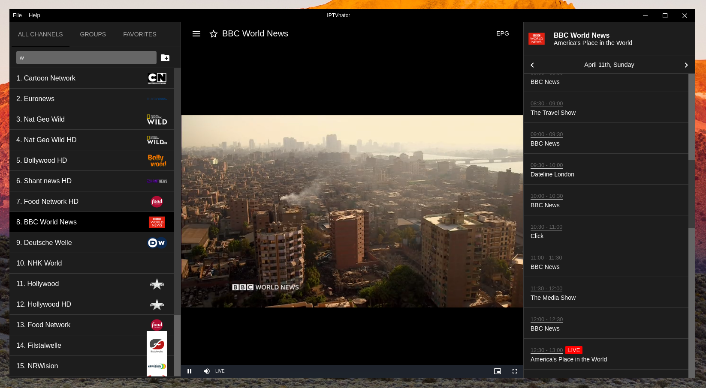
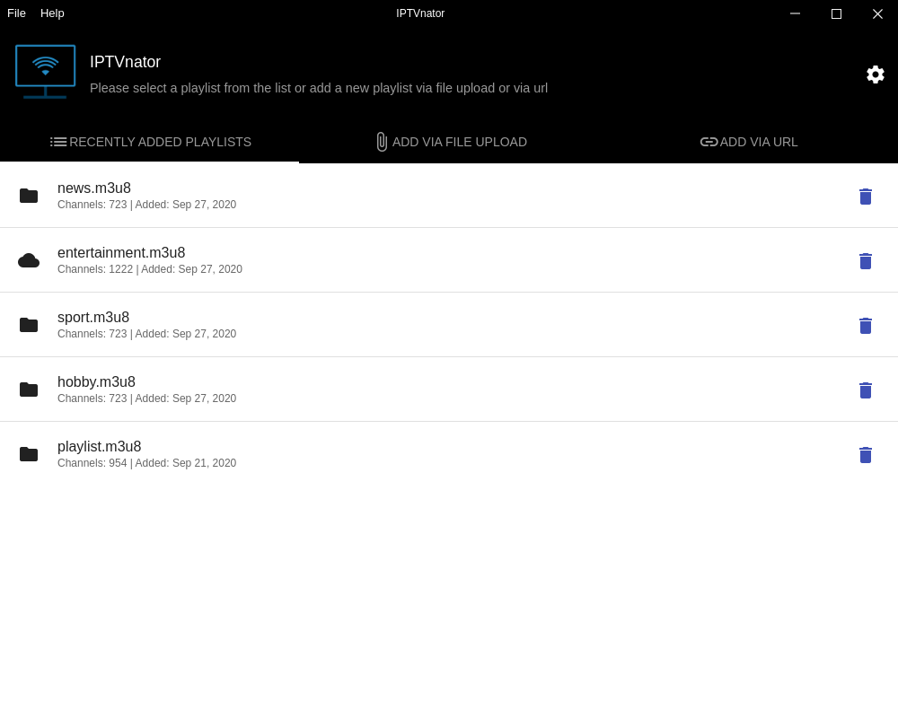
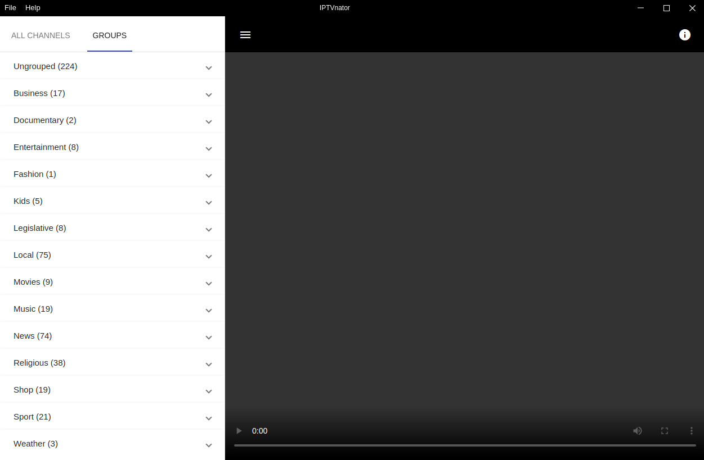
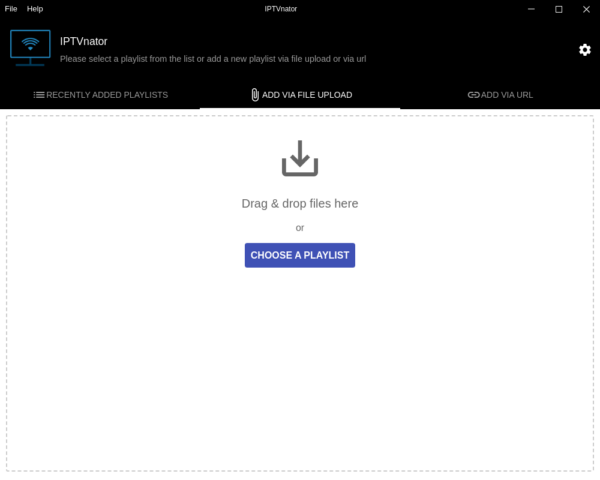
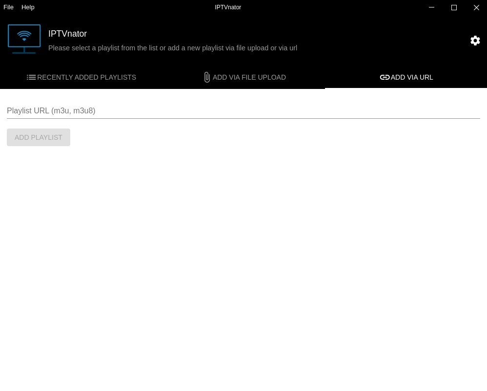
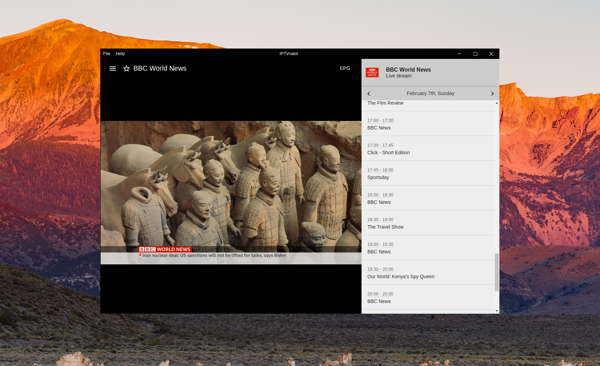
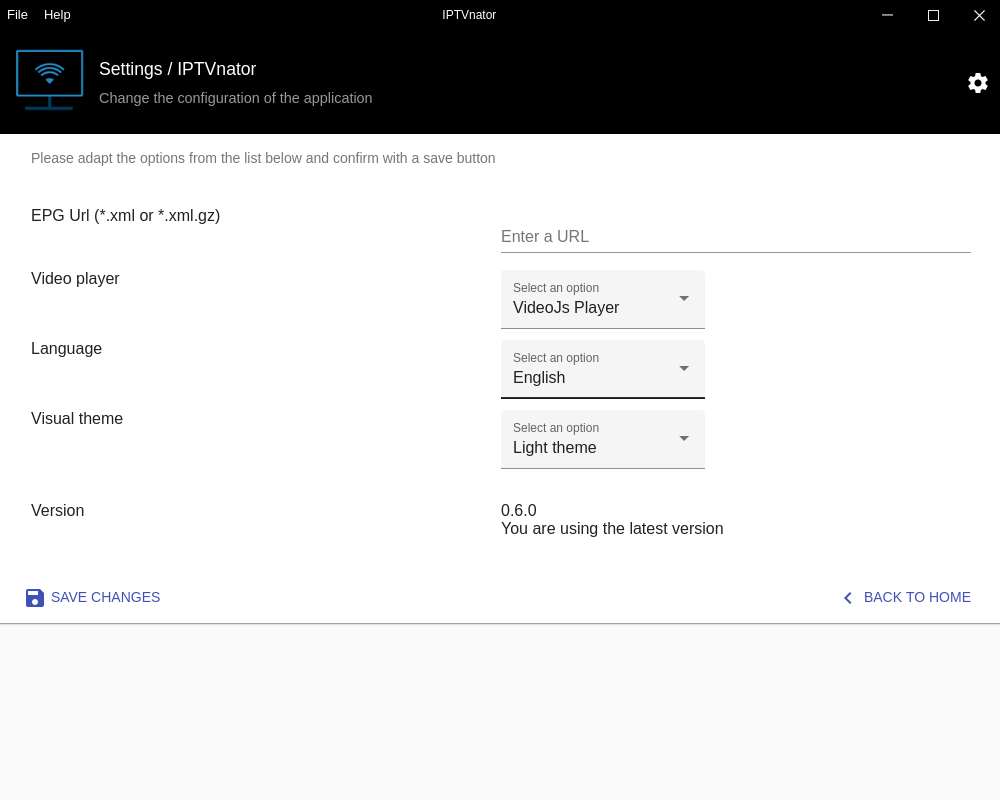
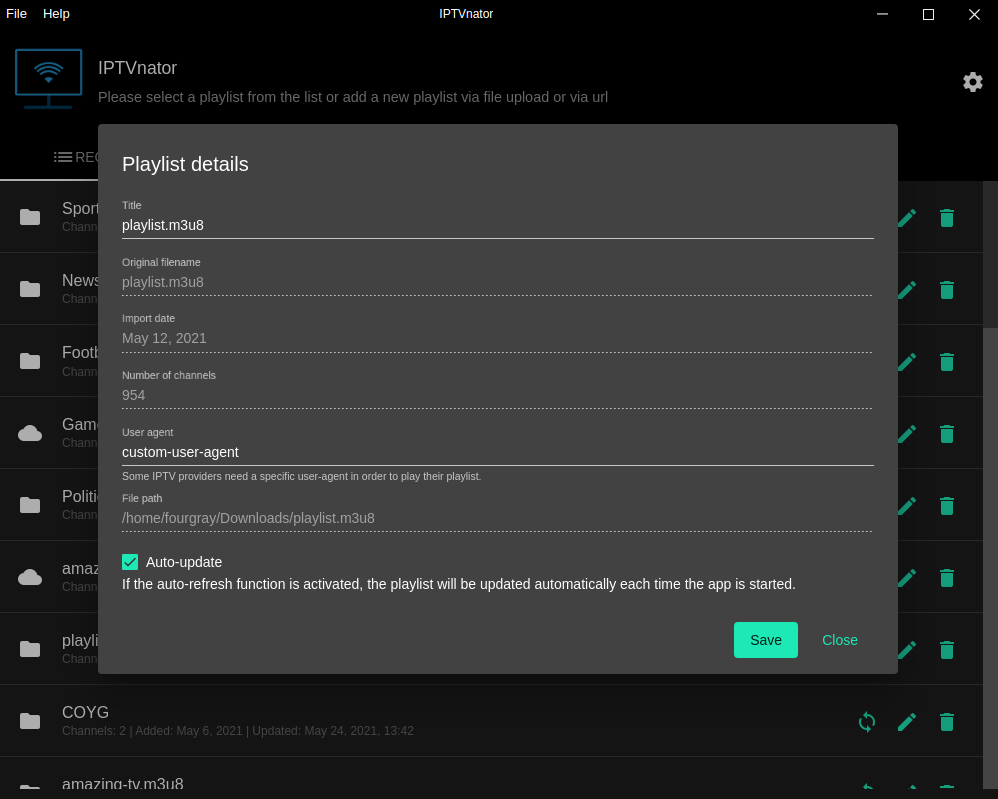

# IPTVnator - IPTV Player Application

<p align="center">
  
</p>
<p align="center">
  <a href="https://github.com/4gray/iptvnator/releases"></a>  <a href="https://github.com/4gray/iptvnator/releases"></a> <a href="https://codecov.io/gh/4gray/iptvnator"></a> <a href="https://twitter.com/iptvnator"></a>
</p>

**IPTVnator** is a video player application that provides support for the playback of IPTV playlists (m3u, m3u8). The application allows to import playlists by using remote URLs or per file upload from the file system. Additionally there is a support of EPG information XMLTV-based which can be provided by URL.

The application is a cross-platform and open source project based on Electron and Angular.

⚠️ Note: IPTVnator doesn't provide any playlists or other digital content. The channels and pictures in the screenshots are for demonstration purposes only.



## Features

- M3u and M3u8 playlists support 📺
- Upload playlists from a file system 📂
- Add remote playlists via URL 🔗
- Playlists auto-update feature
- Open playlist from the file system
- Search for channels 🔍
- EPG support (TV Guide) with detailed info
- TV archive/catchup/timeshift
- Group-based channels list
- Save channels as favorites
- Global favorites aggregated from all playlists
- HTML video player with hls.js support or Video.js based player
- Internalization, currently 7 languages are supported (en, ru, de, ko, es, zh, fr)
- Set custom "User Agent" header for a playlist
- Re-fetch/auto-update playlists
- Light and Dark theme

## Screenshots:

| Welcome screen: Playlists overview                           | Main player interface with channels sidebar and video player                |
| :----------------------------------------------------------: | :-------------------------------------------------------: |
|        |  |
| Welcome screen: Add playlist via file upload                | Welcome screen: Add playlist via URL                      |
|  |              |
| EPG Sidebar: TV guide on the right side                | General application settings
|  |  |
| Playlist settings                |
|  |  |

*Note: First version of the application which was developed as a PWA is available in an extra git branch.*

## Download

Download the latest version of the application for macOS, Windows and Linux from the [release page](https://github.com/4gray/iptvnator/releases).

**IPTVnator** is also available as a snap package:

```
$ sudo snap install iptvnator
```

Also available as an Arch PKG, [iptvnator-bin](https://aur.archlinux.org/packages/iptvnator-bin/), in the AUR (using your favourite AUR-helper, .e.g. `yay`)
```
$ yay -S iptvnator-bin
```

[](https://snapcraft.io/iptvnator)

<a href="https://www.buymeacoffee.com/4gray" target="_blank"></a>

## How to build

Requirements: node.js with npm.

1. Clone this repository and install all project dependencies with:
   ```
   $ npm install
   ```

2. To build the application on your local machine use one of the following commands:
   ```
   # linux
   $ npm run electron:build:linux
   ```

   ```
   #mac
   $ npm run electron:build:mac
   ```

   ```
   # windows
   $ npm run electron:build:windows
   ```

This command will produce the distributable assets in the `release` folder based on the configuration from electron-builder which is stored in `electron-builder.json` and `package.json`. Check the [API description of electron-builder](https://www.electron.build/) and adapt the configuration if you need some special configuration for you environment.

*Note: Don’t expect that you can build app for all platforms on one platform. [Read details](https://www.electron.build/multi-platform-build)*

## Development

The first thing to do is to install all the necessary dependencies:

  ```
  $ npm install
  ```

To develop an application in PWA and Electron mode, you need to run the application with a command:

  ```
  $ npm run start
  ```

The Electron version of the application will open in a separate window, and the PWA version will be available in the browser at http://localhost:4200.

If you want to run only the angular app without electron, in this case you can use the command:

  ```
  $ npm run ng:serve
  ```


## Disclaimer

IPTVnator doesn't provide any playlists or other digital content.

<!-- ALL-CONTRIBUTORS-BADGE:START - Do not remove or modify this section -->
[](#contributors)
<!-- ALL-CONTRIBUTORS-BADGE:END -->
