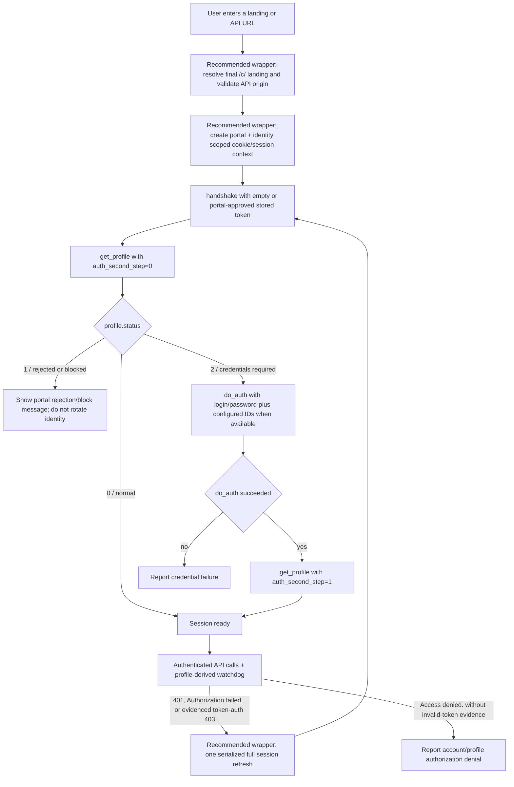

# Stalker/Ministra Authentication and Client Compatibility Audit

Status: Option B Stage 1 implemented; this audit remains the evidence record,
not the runtime contract.

Audit date: 2026-07-26
IPTVnator baseline: `9ae53e451570538770e831e2838a776796284907`

## Scope

This audit compares IPTVnator's Stalker/Ministra implementation with:

- [`Schrittfisch2000/Stalker-Client`](https://github.com/Schrittfisch2000/Stalker-Client)
- public Stalker Middleware/MAG client code
- Team Kodi's active
  [`pvr.stalker`](https://github.com/kodi-pvr/pvr.stalker) repository, currently
  [without a dedicated Stalker maintainer](https://github.com/kodi-pvr/pvr.stalker/issues/255#issuecomment-4400506581)
- other active clients and proxies with substantial adoption or test coverage
- IPTVnator's public Stalker issues and pull requests
- public STBEmu and StbEmuTV documentation and release history

The review covers endpoint discovery, handshake/profile authentication, device
identity, cookies, session refresh, pagination, caching, playback session
lifecycle, persistence, diagnostics, and ideas that can be safely adapted.

Only public source code, documentation, and redacted issue reports were used.
No credentials, private portal traces, or access-control bypass techniques are
part of this audit.

## Executive Summary

At the audited baseline, the main compatibility problem was not simply a
missing serial number. IPTVnator sent an internally inconsistent MAG identity
and skipped the canonical conditional second authentication step:

- the initial `get_profile` incorrectly claims `auth_second_step=1`
- `profile.status=2` is not handled as `do_auth` followed by a second profile
- `do_auth` exists but sends empty credentials and is not called
- `prehash` is `SHA1(uppercase MAC)`, which does not match the public MAG client
- the request says `MAG250` in metrics while omitting or contradicting the
  corresponding firmware, hardware, `stb_type`, `X-User-Agent`, and Referer
- server-issued cookies are not retained in a portal-scoped cookie jar
- endpoint selection depends on URL string patterns instead of discovering the
  actual portal entry point

The strongest public evidence supported keeping IPTVnator's MAC-only default.
Real MAG-only values such as `GetUID()` and
`GetHashVersion1(...)` are opaque native functions, not standard hashes of the
MAC. Invented device IDs can become persistently bound to the MAC; invented
serial or signature values can also fail custom access filters. Recovery may
require restoring the original identity or a provider-side reset.

At the audited baseline, IPTVnator's live-channel pagination was already
stronger than most reviewed clients: it tried `get_all_channels`, fell back to
a bounded concurrent page crawl, calculated page count correctly,
de-duplicated IDs, stopped on repeated pages, retried once, and kept a
last-good in-memory ITV catalog cache. The next useful caching step is a
semantic SQLite snapshot with stale-while-revalidate, not a generic HTTP cache
for authentication or stream links.

`Schrittfisch2000/Stalker-Client` is useful as a small idea source, but it is
not an authentication reference: at the audited commit it had no license, no
issues, no stars or forks, and its first pull request explicitly noted the lack
of a real portal E2E test. Its profile flow repeats several of IPTVnator's
mistakes and its fallback pagination treats `max_page_items` as a page count.

Difference severity is high for credential-required, strict-fingerprint, and
custom-path portals, because request order or endpoint selection can fail
before catalog access. It is moderate for permissive MAC-only portals: the
handshake/Bearer foundation is present, so servers that ignore the inconsistent
profile can still work. This explains why compatibility can look random across
providers without serial number being the single missing field.

## Implementation Outcome

The approved Option B foundation was implemented on 2026-07-27. The canonical
runtime contract is now
[Stalker Portal Architecture](./stalker-portal.md); this document intentionally
keeps the audited baseline and source comparisons unchanged.

Stage 1 now provides:

- bounded root, landing, custom-prefix, `portal.php`, and `server/load.php`
  discovery with explicit cross-origin approval
- a main-process RFC cookie jar and server-issued cookie rotation
- first profile with `auth_second_step=0`, conditional status-2 `do_auth`, and
  second profile with step `1`
- one versioned MAC-only-by-default identity preset with explicit, stable
  overrides and no invented serial/device/hash values
- main-owned token generations, principal coordination, single-flight refresh,
  profile-derived watchdogs, and sender-bound playback contexts
- typed IPC operations that expose opaque references and sanitized outcomes,
  while preserving the simple/PWA compatibility adapter
- save-before-commit import and lazy route migration, with credentials requested
  only after status `2`
- default-redacted provider backups and deterministic, secret-scanned replay
  fixtures
- final acceptance hardening that rejects anonymous public-to-private redirect
  hops before contact, treats unknown HTML denials as terminal, keeps the
  credential budget across coordinator races, and invalidates learned recipe
  state on every backup restore

Semantic SQLite catalog snapshots/FTS and adaptive or resumable pagination
remain Stage 2; Stage 1 deliberately keeps the existing bounded in-memory
crawl. Evidence-driven HTTP 462 handling, previous-stream release, and broader
playback-session lifecycle remain Stage 3. Authenticated web-player/download
context consumers, the signed image proxy, and exportable compatibility
reports are also not part of Stage 1.

## Evidence Hierarchy

| Confidence | Source                                                   | What it can establish                                                              | Important limitation                                                             |
| ---------- | -------------------------------------------------------- | ---------------------------------------------------------------------------------- | -------------------------------------------------------------------------------- |
| High       | Public Stalker Middleware server and MAG frontend source | Request order, status branches, token storage policy, server-side identity binding | Historical versions; proprietary portal forks may differ                         |
| High       | Kodi `pvr.stalker`                                       | A mature independent state machine, retries, Referer/X-UA, watchdog timing         | Kodi's default identity values are not a replacement for a real MAG fingerprint  |
| Medium     | Active clients with tests and users                      | Defensive endpoint handling, persistence, synchronization, UX patterns             | Popularity does not prove protocol correctness                                   |
| Medium     | IPTVnator and Kodi issue reports                         | Real failure modes and compatibility symptoms                                      | Reports often lack sanitized traces or a confirmed root cause                    |
| Low        | Reverse-engineered hash recipes and scanner tools        | Candidate hypotheses for controlled experiments                                    | Frequently synthetic, mutually inconsistent, or unsafe to send to a real account |
| Low        | Closed-source app release notes                          | Existence of user-facing cache or login features                                   | Cannot establish what is cached or how authentication is implemented             |

Exact identity hash recipes are deliberately excluded from the recommended
design unless they can be verified against a user-owned device trace and a
sanitized fixture.

## Authentication Core and Compatibility Wrappers

The public MAG frontend and Kodi agree on the authentication core below.
Endpoint discovery, scoped cookie ownership, classified 403 handling, and
serialized refresh are recommended compatibility and safety wrappers rather
than canonical MAG steps.

The initial profile is always the first step. `do_auth` is conditional; it is
not a ritual request that every portal requires. A successful second profile
is what proves that the second step completed.

Primary evidence:

- MAG handshake and first profile:
  [`xpcom.common.js`](https://github.com/iptvhakr/stalker_portal/blob/72deceee1e32ea00cf33ecf2376b80902ab11134/c/xpcom.common.js#L850-L967)
- MAG status and credential branch:
  [`xpcom.common.js`](https://github.com/iptvhakr/stalker_portal/blob/72deceee1e32ea00cf33ecf2376b80902ab11134/c/xpcom.common.js#L296-L359)
- server-side `doAuth`:
  [`stb.class.php`](https://github.com/iptvhakr/stalker_portal/blob/0eb23e4995222e7c3daa4b945a4e962703ebf0cc/server/lib/stb.class.php#L2140-L2175)
- Kodi session flow:
  [`SessionManager.cpp`](https://github.com/kodi-pvr/pvr.stalker/blob/07989d2d8e5542135c5c7107ffeb4c316f7f65fc/src/stalker/SessionManager.cpp#L30-L183)

There is no canonical hard-coded 10-, 15-, or 60-minute token lifetime in
these sources. Refresh should be outcome-driven and serialized.

## Audited Baseline Differences (`9ae53e45`)

### Priority Matrix

| Priority | Area                | Audited behavior                                                                    | Evidence-based target                                                                                     |
| -------- | ------------------- | ----------------------------------------------------------------------------------- | --------------------------------------------------------------------------------------------------------- |
| P0       | First profile       | Always sends `auth_second_step=1`                                                   | First profile uses `0`; only a successful `do_auth` permits `1`                                           |
| P0       | Credential branch   | Ignores `profile.status`; unused `do_auth` sends empty login/password               | On status `2`, use imported credentials plus configured IDs when available, then fetch the second profile |
| P0       | Endpoint resolution | Infers mode from `/stalker_portal` and rewrites only a few suffixes                 | Validate the final origin, then use bounded MAC-only probes before any token/credentials                  |
| P0       | Device profile      | MAG250 metrics conflict with blank/missing firmware and transport fields            | One coherent, versioned device-profile preset plus an explicit traced-identity mode                       |
| P0       | `prehash`           | Sends uppercase `SHA1(MAC)` and labels it real-client compatible                    | Omit when not applicable; only send a profile-version algorithm backed by evidence                        |
| P1       | Challenge           | Invents a random value when handshake omits one                                     | Preserve absence; do not manufacture challenge-derived fields                                             |
| P1       | Headers             | Full browser UA is duplicated into `X-User-Agent`; no API Referer                   | Coherent browser UA, `X-User-Agent: Model: ...; Link: ...`, and resolved `/c/` Referer                    |
| P1       | Cookies             | Rebuilds static cookies and synthesizes `__cfduid`; ignores `Set-Cookie`            | Portal/identity-scoped cookie jar plus only the canonical bootstrap cookies                               |
| P1       | Token               | Persists a token at import, ignores it at runtime, keys memory state by playlist ID | Scope by canonical endpoint + MAC + identity revision; persist only when portal requests it               |
| P1       | Error taxonomy      | Recognizes 401 and one text form; not 403 or `Access denied.`                       | Classify HTTP and HTTP-200 body failures; refresh once without loops                                      |
| P1       | Watchdog            | Fixed 25-second interval                                                            | Use bounded profile `timeslot`/`watchdog_timeout` with jitter                                             |
| P1       | Credentials         | Dormant username/password controls are hidden, included in form data, and unused    | Expose/use them only for status-2 auth and define secure storage/backup behavior                          |
| P2       | Metadata comments   | Interface comments claim generated IDs and useful persisted session token           | Correct comments when the runtime contract is implemented                                                 |

### P0: `auth_second_step` and Status Handling

In
[`stalker-session.service.ts`](https://github.com/4gray/iptvnator/blob/9ae53e451570538770e831e2838a776796284907/libs/portal/stalker/data-access/src/lib/stalker-session.service.ts#L293-L459),
the first profile always sends `auth_second_step: '1'`. `authenticate()` accepts
any profile without branching on `status`. The existing `doAuth()` sends blank
credentials and is never called.

This is a protocol bug, not merely an optional enhancement. In the public
4.9-era server, `auth_second_step=1` changes the `auth_every_load` branch even
though IPTVnator never completed the second step:

[`stb.class.php`](https://github.com/iptvhakr/stalker_portal/blob/0eb23e4995222e7c3daa4b945a4e962703ebf0cc/server/lib/stb.class.php#L555-L601).

### P0: Endpoint Discovery

The import flow:

- considers a portal "full" only when the original URL contains
  `/stalker_portal`
- rewrites a generic `/c` to `/portal.php`
- leaves a root URL unchanged
- maps a custom `<prefix>/c` to `<prefix>/portal.php`, which is wrong for
  canonical Middleware installations whose API is
  `<prefix>/server/load.php`

See
[`stalker-portal-import.component.ts`](https://github.com/4gray/iptvnator/blob/9ae53e451570538770e831e2838a776796284907/libs/playlist/import/feature/src/lib/stalker-portal-import/stalker-portal-import.component.ts#L198-L275).

The public MAG frontend instead derives sibling `server/load.php` from the
actual loaded `/c/` document path; it does not require the literal directory
name `stalker_portal`:

[`xpcom.common.js`](https://github.com/iptvhakr/stalker_portal/blob/72deceee1e32ea00cf33ecf2376b80902ab11134/c/xpcom.common.js#L387-L400).

A safe resolver needs two phases:

1. normalize a URL that may be a root, `/c`, `/c/`, `portal.php`, or
   `server/load.php`
2. follow landing redirects without MAC, token, credentials, or device IDs
3. derive same-origin sibling candidates from the resolved path
4. validate the final origin and require explicit user confirmation before
   trusting an origin change
5. only then run a bounded MAC-only handshake probe against the candidates,
   still without Bearer token, password, or optional device IDs
6. inspect status, content type, body shape, and known auth outcomes, then save
   the selected endpoint, landing Referer, and auth recipe

MAC cookies, credentials, and Bearer tokens must never be forwarded to an
unvalidated redirect target.

### P0: Incoherent Device Profile

IPTVnator currently combines:

- `metrics.model = MAG250`
- `metrics.type = STB`
- `stb_type = ''`
- no coherent `ver`, `client_type`, `image_version`, `hw_version`,
  `hw_version_2`, or timestamp
- `SHA1(MAC)` as `prehash`
- a browser MAG250 UA copied verbatim into `X-User-Agent`
- no API Referer
- hard-coded `stb_lang=en_US@rg=dezzzz`, `timezone=Europe/Berlin`, and
  `Accept-Language=en-US` instead of one configurable locale/timezone profile

See
[`stalker-session.service.ts`](https://github.com/4gray/iptvnator/blob/9ae53e451570538770e831e2838a776796284907/libs/portal/stalker/data-access/src/lib/stalker-session.service.ts#L244-L345)
and
[`stalker-identity.ts`](https://github.com/4gray/iptvnator/blob/9ae53e451570538770e831e2838a776796284907/apps/electron-backend/src/app/events/stalker-identity.ts#L23-L57).

Strict portals can reject inconsistent firmware/metrics. A Kodi report includes
the portal-returned profile message "Old firmware, missing metrics or hash":

[`kodi-pvr/pvr.stalker#192`](https://github.com/kodi-pvr/pvr.stalker/issues/192#issuecomment-1256963480).

The fix is not to fill every field with an invented hash. The safe model is:

- a versioned, internally coherent compatibility profile for non-opaque
  browser/model/firmware/header/locale/timezone fields
- MAC-only identity by default
- a separate advanced profile containing stable, user-provided values observed
  from the user's own device
- no automatic identity cycling after failure

### Why Serial and Device IDs Must Not Be Invented

In the public MAG client:

- `device_id` comes from native `stb.GetUID()`
- `signature` comes from a challenge form of the same opaque native function
- `prehash` is version-dependent; in one public version it is
  `GetHashVersion1(model, firmwarePrefix)`, while older variants differ

The YASEM maintainer could not reproduce `GetUID` and therefore exposed
configured values rather than claiming a standard JavaScript hash:

- [`gstb.cpp`](https://github.com/mvasilchuk/yasem-mag-api/blob/f3646885e899a9b7e94905ebda3043eec5276473/gstb.cpp#L2325-L2351)
- [`yasem-mag-api#1`](https://github.com/mvasilchuk/yasem-mag-api/issues/1)

The public server can bind the first non-empty device IDs to a MAC and reject a
later mismatch:

[`stb.class.php`](https://github.com/iptvhakr/stalker_portal/blob/0eb23e4995222e7c3daa4b945a4e962703ebf0cc/server/lib/stb.class.php#L467-L531).

This matches IPTVnator's own history:

- [`#860`](https://github.com/4gray/iptvnator/issues/860): a generated device ID
  caused the account to stop working in STBEmu
- [`#927`](https://github.com/4gray/iptvnator/issues/927): values entered by the
  user were not forwarded, producing a device-ID conflict
- [`#941`](https://github.com/4gray/iptvnator/pull/941): fixed passthrough and
  removed blank-field generation

Keep that policy. Serial remains valuable as an explicit field because custom
access filters may require it, but a fake default serial is not safer than no
serial.

### P1: Cookies and the Synthetic `__cfduid`

The stock bootstrap cookies are `mac`, `stb_lang`, and `timezone`; a real
browser also retains server-issued `Set-Cookie` values. IPTVnator reconstructs
the bootstrap string on every request and has no portal-scoped cookie jar.

When a serial is present, IPTVnator also derives a fixed 32-character
`__cfduid`. This is not a canonical Stalker identity mechanism. Cloudflare
deprecated that cookie and stopped setting it on 2021-05-10:

[`Deprecating the __cfduid cookie`](https://blog.cloudflare.com/deprecating-cfduid-cookie/).

The target design should:

- use one cookie jar per canonical endpoint and stable identity revision
- preserve same-origin server-issued session cookies
- clear or migrate the jar when endpoint or identity changes
- remove the synthetic `__cfduid` from the normal profile
- treat the current `SN` HTTP header as an explicit legacy compatibility quirk,
  not part of the normal MAG profile; canonical public code uses serial in
  `get_profile.sn` and metrics
- treat actual Cloudflare challenges as a diagnostic outcome, not something to
  bypass with guessed cookies

### P1: Token Persistence and Session Scope

The public MAG client offers a previously stored token during handshake, but
stores it only when the returned profile enables `store_auth_data_on_stb`:

- client:
  [`xpcom.common.js`](https://github.com/iptvhakr/stalker_portal/blob/72deceee1e32ea00cf33ecf2376b80902ab11134/c/xpcom.common.js#L850-L920)
  and
  [`token policy`](https://github.com/iptvhakr/stalker_portal/blob/72deceee1e32ea00cf33ecf2376b80902ab11134/c/xpcom.common.js#L1118-L1120)
- server:
  [`stb.class.php`](https://github.com/iptvhakr/stalker_portal/blob/0eb23e4995222e7c3daa4b945a4e962703ebf0cc/server/lib/stb.class.php#L299-L373)

IPTVnator currently saves `stalkerToken` during import but deliberately ignores
it in `ensureToken()`. The in-memory token and single-flight maps use playlist
ID as their key. The audited stock server validates and stores the access token
on the user row found by MAC, so two playlist records with the same endpoint
and MAC can create competing sessions.

Choose one explicit policy:

- do not persist tokens at all, or
- persist them in protected Electron storage only when the profile requests it,
  offer them to handshake as a bootstrap hint, and clear them on `not_valid` or
  classified rejection

In both cases, live session state should be scoped by the tuple of canonical
endpoint, MAC, and stable identity revision rather than playlist ID alone.

### P1: Error and Refresh Taxonomy

The public frontend recognizes literal HTTP-200 bodies such as
`Authorization failed.` and `Access denied.`, but they are not equivalent.
Invalid-token evidence can trigger refresh, while `Access denied.` can be an
account/profile authorization cutoff:

[`xpcom.common.js`](https://github.com/iptvhakr/stalker_portal/blob/72deceee1e32ea00cf33ecf2376b80902ab11134/c/xpcom.common.js#L698-L795).

IPTVnator's current
[`isAuthorizationError`](https://github.com/4gray/iptvnator/blob/9ae53e451570538770e831e2838a776796284907/libs/portal/stalker/data-access/src/lib/stalker-session.service.ts#L526-L554)
recognizes HTTP 401 and one family of authorization text, but not HTTP 403 or
the plain `Access denied.` outcome.

Use a bounded classifier:

| Outcome                                                                     | Action                                                                                               |
| --------------------------------------------------------------------------- | ---------------------------------------------------------------------------------------------------- |
| 401, `Authorization failed.`, or another proven token rejection             | Invalidate session and run one serialized full refresh                                               |
| 403 with evidence of portal token rejection                                 | One refresh, then report the result                                                                  |
| 403 with HTML/challenge markers                                             | Report WAF/challenge; do not loop                                                                    |
| `Access denied.` or rejected/blocked profile without invalid-token evidence | Show the account/profile denial; do not refresh by default                                           |
| 404, HTML instead of API JSON, or wrong content type                        | Re-run endpoint discovery without secrets                                                            |
| 429 or transient 5xx                                                        | Bounded backoff with jitter                                                                          |
| Device conflict/block status                                                | Keep identity stable and show actionable portal text                                                 |
| HTTP 462 during playback                                                    | Test recreating `create_link` and releasing a previous stream session; do not rotate global identity |

IPTVnator already has the right high-level single-flight and retry-once shape.
It needs broader classification and a full
`handshake -> first profile -> conditional second step` refresh.

### P1: Watchdog

IPTVnator pings every 25 seconds. Kodi reads the portal's `timeslot` and
watchdog fields, and treats watchdog authorization failure as a session
outcome:

[`SessionManager.cpp`](https://github.com/kodi-pvr/pvr.stalker/blob/07989d2d8e5542135c5c7107ffeb4c316f7f65fc/src/stalker/SessionManager.cpp#L219-L240).

The interval should be profile-derived, bounded to safe minimum/maximum values,
and jittered. The canonical MAG lifecycle starts its watchdog for the portal
session, not only during playback. IPTVnator may choose a playback-scoped
watchdog as a traffic optimization, but that scope needs fixture evidence.

## Audit of `Schrittfisch2000/Stalker-Client`

Audited commit:
[`ec4d34a919e55cd660004d3ed8a905374b727eb9`](https://github.com/Schrittfisch2000/Stalker-Client/tree/ec4d34a919e55cd660004d3ed8a905374b727eb9).

### What It Does Well

- compact separation between backend portal access and browser UI
- same-origin media/image proxying instead of exposing every remote URL to the
  browser
- global search across loaded content
- persisted local configuration, favorites, recent items, and playback
  progress
- signed image proxy URLs
- redacted diagnostics
- a short live-list memory cache
- restart logic in
  [`PR #11`](https://github.com/Schrittfisch2000/Stalker-Client/pull/11)
  that recreates a `create_link` result and releases a previous session after
  HTTP 462

The HTTP 462 work is a useful hypothesis for IPTVnator's live-playback issues,
but it is not evidence that IPTVnator has the same root cause.

### Where It Is Weaker

Its main Stalker implementation is in
[`app/stalker.py`](https://github.com/Schrittfisch2000/Stalker-Client/blob/ec4d34a919e55cd660004d3ed8a905374b727eb9/app/stalker.py).

- API endpoint is effectively hard-coded around `portal.php`
- a new HTTP client is created for requests, so there is no durable cookie jar
- token lifetime is assumed to be 15 minutes
- handshake `random` is discarded
- profile sends a default serial, empty IDs/signature,
  `auth_second_step=1`, and no coherent challenge hash
- pagination interprets `max_page_items` as if it were a page count
- the full live list is cached only for 90 seconds in process memory
- the issue tracker has no reports from which compatibility can be inferred
- [`PR #1`](https://github.com/Schrittfisch2000/Stalker-Client/pull/1)
  says a real portal E2E test was not possible without private credentials
- the audited repository has no license, so code must not be copied

Conclusion: borrow product ideas and the HTTP 462 test hypothesis, not its auth
payloads or pagination algorithm.

## Other Serious Clients and Proxies

Adoption numbers are a snapshot from 2026-07-26. They help discover candidates;
they are not a protocol correctness score.

| Project                                                                                                        | Adoption/activity                        | Test evidence                                                         | Best ideas                                                                                                                                                                              | Protocol or legal caveat                                                                                                      |
| -------------------------------------------------------------------------------------------------------------- | ---------------------------------------- | --------------------------------------------------------------------- | --------------------------------------------------------------------------------------------------------------------------------------------------------------------------------------- | ----------------------------------------------------------------------------------------------------------------------------- |
| [Kodi `pvr.stalker`](https://github.com/kodi-pvr/pvr.stalker/tree/07989d2d8e5542135c5c7107ffeb4c316f7f65fc)    | 47 stars, 65 forks; active in July 2026  | No repository-level Stalker test suite                                | Correct conditional second step, retries, Referer/X-UA, profile-derived watchdog, optional EPG disk cache                                                                               | GPL-2.0; no dedicated maintainer; do not treat its static default IDs as real MAG values                                      |
| [StreamVault-IPTV](https://github.com/Davidona/StreamVault-IPTV/tree/593333714c43cb1802e14a1452cd9f5906e0a286) | 547 stars, 88 forks; active in July 2026 | Dedicated Stalker tests and 16 sanitized replay fixtures; no live E2E | Room catalog, FTS, WorkManager sync, staged atomic replacement, partial-sync upsert guard, cache TTLs, endpoint/profile hints, response size bounds, defer catalog sync during playback | Custom non-commercial source-available license; auth sends second-step too early, discards random, and uses synthetic metrics |
| [OwnTV](https://github.com/ahXN00/OwnTV/tree/26f68f558f6879045755eea92d614773dd501d5a)                         | 279 stars, 45 forks; active in July 2026 | Nine test files                                                       | Minimal MAC-only auth, per-source mutex/single-flight, endpoint probing, in-memory winning endpoint, bounded one-time refresh                                                           | GPL-3.0; no conditional `do_auth`; hard-coded token TTL; incomplete HTTP-200 body-error classification                        |
| [ynoTV](https://github.com/tbeezy/ynotv/tree/3219ca0c7717c07f40e52a4661fd118a219a6c81)                         | 209 stars, 9 forks; active in July 2026  | No repository-level test suite                                        | SQLite catalogs, EPG cache, watchlist, reminders, DVR, series/VOD fallback                                                                                                              | AGPL-3.0; unverified MD5/SHA identity formulas, token logging, hard-coded TTL/page size, no `do_auth`                         |
| [uiptv](https://github.com/xixogo5105/uiptv/tree/e3bd949cc7819e9438efadbe45aed6bbf779af28)                     | 47 stars, 6 forks; active in July 2026   | Broad test tree; endpoint tests preserve known malformed URLs         | Reads endpoint hints from `xpcom.common.js`, then probes common endpoints                                                                                                               | MIT; sends fresh random signatures that could change device identity                                                          |
| [tuliprox](https://github.com/euzu/tuliprox/tree/bcc1badcfeb484ffbb325222f80b19bde850f314)                     | 512 stars, 52 forks; active in July 2026 | Stalker unit tests, but the integration is recent                     | Defensive endpoint candidates, cookie/session ownership, JSONP/BOM/HTML parsing, response caps, redacted failure taxonomy, serialized refresh, learned recipe/capability architecture   | MIT; configured identity fields appear incomplete and some refresh hooks are not wired outside tests                          |

### StreamVault Patterns Worth Re-implementing

The strongest cache/sync reference is StreamVault, not its auth recipe:

- content policy:
  [`ContentCachePolicy.kt`](https://github.com/Davidona/StreamVault-IPTV/blob/593333714c43cb1802e14a1452cd9f5906e0a286/data/src/main/java/com/streamvault/data/sync/ContentCachePolicy.kt)
- constrained background indexing:
  [`StalkerIndexWorker.kt`](https://github.com/Davidona/StreamVault-IPTV/blob/593333714c43cb1802e14a1452cd9f5906e0a286/data/src/main/java/com/streamvault/data/sync/StalkerIndexWorker.kt)
- staged catalog writes and partial-sync protection:
  [`SyncCatalogStore.kt`](https://github.com/Davidona/StreamVault-IPTV/blob/593333714c43cb1802e14a1452cd9f5906e0a286/data/src/main/java/com/streamvault/data/sync/SyncCatalogStore.kt)
- persistent per-category hydration state:
  [`Entities.kt`](https://github.com/Davidona/StreamVault-IPTV/blob/593333714c43cb1802e14a1452cd9f5906e0a286/data/src/main/java/com/streamvault/data/local/entity/Entities.kt#L850-L908)
- adaptive page loading with resume and page fingerprints:
  [`SyncManager.kt`](https://github.com/Davidona/StreamVault-IPTV/blob/593333714c43cb1802e14a1452cd9f5906e0a286/data/src/main/java/com/streamvault/data/sync/SyncManager.kt#L1933-L2180)
- sanitized capture-to-fixture workflow:
  [`fixtures/README.md`](https://github.com/Davidona/StreamVault-IPTV/blob/593333714c43cb1802e14a1452cd9f5906e0a286/data/src/test/resources/stalker/fixtures/README.md#L1-L29)
- auth payload caveat:
  [`OkHttpStalkerApiService.kt`](https://github.com/Davidona/StreamVault-IPTV/blob/593333714c43cb1802e14a1452cd9f5906e0a286/data/src/main/java/com/streamvault/data/remote/stalker/OkHttpStalkerApiService.kt)

Because of the custom license, these are architecture observations only.
Its hydration/resume model is useful, but its pagination completion semantics
are not: `totalPages()` silently caps a result at 200 pages:

[`OkHttpStalkerApiService.kt`](https://github.com/Davidona/StreamVault-IPTV/blob/593333714c43cb1802e14a1452cd9f5906e0a286/data/src/main/java/com/streamvault/data/remote/stalker/OkHttpStalkerApiService.kt#L1588-L1601).

At a safety cap, prefer tuliprox's explicit incomplete outcome.

### tuliprox Patterns Worth Re-implementing

tuliprox is valuable for defensive transport design:

- preserve custom path prefixes while trying `server/load.php`, `portal.php`,
  and `/c`
- keep a stateful cookie context
- tolerate JSONP, BOMs, and HTML error responses
- cap response bodies
- redact tokens, MACs, and credentials in diagnostics
- serialize session refresh behind a lock
- separate learned endpoint capabilities from identity-bound data

Its generic HLS segment cache is not evidence for a Stalker catalog cache, and
its current identity/profile values should not be copied as a protocol oracle.

Its catalog pagination does add two useful contracts:

- accept `total_items`, `max_page_items`, and `max_page` as separate hints
- return an explicit incomplete result at a safety cap instead of silently
  presenting a truncated catalog as complete

See
[`catalog.rs`](https://github.com/euzu/tuliprox/blob/bcc1badcfeb484ffbb325222f80b19bde850f314/backend/src/utils/network/stalker/catalog.rs#L364-L440).
Support for object-keyed `data` payloads is another inexpensive compatibility
improvement worth testing.

### OwnTV: A Safer Minimal Baseline

OwnTV intentionally leaves SN/device/signature blank until a real incompatible
portal demonstrates a need. It keeps session state per source, serializes
authentication with a mutex, retries only once, and keeps the endpoint that won
a bounded probe for the current in-memory session:

- [`StalkerAuthManager.kt`](https://github.com/ahXN00/OwnTV/blob/26f68f558f6879045755eea92d614773dd501d5a/app/src/main/java/tv/own/owntv/core/stalker/StalkerAuthManager.kt#L22-L104)
- [`StalkerClient.kt`](https://github.com/ahXN00/OwnTV/blob/26f68f558f6879045755eea92d614773dd501d5a/app/src/main/java/tv/own/owntv/core/stalker/StalkerClient.kt#L96-L136)

This supports IPTVnator's MAC-only default, but OwnTV is not a complete protocol
reference: it has no status-2 `do_auth`, assumes a five-minute token TTL, and
does not recognize every plain-text authorization body.

### Ideas Versus Folklore in ynoTV and uiptv

ynoTV offers useful product patterns around SQLite, EPG, watchlists, reminders,
DVR, and VOD/series fallback. Its auth identity is not safe evidence: it
derives serial and device fields from undocumented MD5/SHA formulas, duplicates
the device ID, logs a Bearer token, and has no conditional `do_auth`:

- identity formulas:
  [`stalker-client.ts`](https://github.com/tbeezy/ynotv/blob/3219ca0c7717c07f40e52a4661fd118a219a6c81/packages/local-adapter/src/stalker-client.ts#L42-L105)
- auth, token refresh, and token logging:
  [`stalker-client.ts`](https://github.com/tbeezy/ynotv/blob/3219ca0c7717c07f40e52a4661fd118a219a6c81/packages/local-adapter/src/stalker-client.ts#L430-L615)
- hard-coded pagination:
  [`stalker-client.ts`](https://github.com/tbeezy/ynotv/blob/3219ca0c7717c07f40e52a4661fd118a219a6c81/packages/local-adapter/src/stalker-client.ts#L820-L880)

uiptv has an appealing endpoint idea: inspect `xpcom.common.js` before probing
common API paths:

[`PingStalkerPortal.java`](https://github.com/xixogo5105/uiptv/blob/e3bd949cc7819e9438efadbe45aed6bbf779af28/core/src/main/java/com/uiptv/util/PingStalkerPortal.java#L31-L154).

However, its tests preserve a
[duplicated path](https://github.com/xixogo5105/uiptv/blob/e3bd949cc7819e9438efadbe45aed6bbf779af28/core/src/test/java/com/uiptv/util/PingStalkerPortalTest.java#L20-L35)
and a
[missing slash](https://github.com/xixogo5105/uiptv/blob/e3bd949cc7819e9438efadbe45aed6bbf779af28/core/src/test/java/com/uiptv/util/PingStalkerPortalTest.java#L103-L106).
Its auth also generates fresh UUID-like signature/random values:

[`HandshakeService.java`](https://github.com/xixogo5105/uiptv/blob/e3bd949cc7819e9438efadbe45aed6bbf779af28/core/src/main/java/com/uiptv/service/HandshakeService.java#L90-L148).

Borrow endpoint discovery as an independently tested behavior; do not borrow
the generated identity.

## STBEmu and StbEmuTV

Two products are easy to conflate:

- Android STBEmu has public
  [profile documentation](https://docs.stbemu.com/en/profiles.html) and
  [common settings documentation](https://docs.stbemu.com/en/common_settings.html)
- macOS/iOS StbEmuTV is a separate closed-source product whose public evidence
  is its
  [App Store page](https://apps.apple.com/ca/app/stbemutv-premium/id1589654283?mt=12)
  and version history

The public Android documentation confirms that a successful emulator presents
a coherent STB profile: model, firmware, UA, MAC, optional serial and device
IDs, signature settings, vendor, and hardware version belong to one profile.
That coherence is a more plausible reason for broad compatibility than merely
sending more fields.

The documentation also exposes a generic network cache and warns that it may
need to be disabled when authentication errors become too frequent. This is
strong evidence against applying a blind HTTP cache to handshake, profile, or
`create_link`.

The macOS/iOS StbEmuTV release history mentions network cache settings, clear
cache/reset support, restored fast login, and repeated portal/login fixes. That
supports the user's observation that persistence exists, but the closed source
does not reveal whether the implementation stores HTTP resources, a semantic
catalog, tokens, cookies, or some combination. It should be treated as a
product clue, not a protocol specification.

## Pagination and Cache Comparison

### What IPTVnator Already Gets Right

Current `main`:

- tries the canonical `itv/get_all_channels` action first
- falls back to `get_ordered_list`
- computes `ceil(total_items / max_page_items)`
- fetches with bounded concurrency
- retries each failed page once
- de-duplicates channel IDs
- stops when a portal repeats a page or contributes no new IDs
- caps a crawl at 30,000 channels
- uses per-playlist-record single-flight state, falling back to portal URL when
  no playlist ID exists, plus a 30-second failure cooldown
- serves stale data while a manual refresh is running

See
[`stalker-itv-channel-loader.ts`](https://github.com/4gray/iptvnator/blob/9ae53e451570538770e831e2838a776796284907/libs/portal/stalker/data-access/src/lib/stalker-itv-channel-loader.ts)
and
[`stalker-itv-cache.service.ts`](https://github.com/4gray/iptvnator/blob/9ae53e451570538770e831e2838a776796284907/libs/portal/stalker/data-access/src/lib/stalker-itv-cache.service.ts).

The official list logic and Kodi use the same page-count interpretation:

- MAG list:
  [`layer.list.js`](https://github.com/iptvhakr/stalker_portal/blob/72deceee1e32ea00cf33ecf2376b80902ab11134/c/layer.list.js#L230-L275)
- Kodi:
  [`ChannelManager.cpp`](https://github.com/kodi-pvr/pvr.stalker/blob/07989d2d8e5542135c5c7107ffeb4c316f7f65fc/src/stalker/ChannelManager.cpp#L18-L58)

The "search only sees 14 channels" report in
[`#1146`](https://github.com/4gray/iptvnator/issues/1146) was fixed on `main`
by [`#1209`](https://github.com/4gray/iptvnator/pull/1209), merged on
2026-07-23. It is still a valid symptom for the 2026-07-05 v0.22 release.

### Recommended Persistent Cache

The audited stock Stalker 4.9.35 `load.php` sets
`Cache-Control: no-store`; proprietary forks may differ:

[`server/load.php`](https://github.com/iptvhakr/stalker_portal/blob/0eb23e4995222e7c3daa4b945a4e962703ebf0cc/server/load.php#L1-L21).

Therefore persistent caching should be an explicit app-level semantic snapshot,
not an implicit HTTP cache.

Recommended design:

- SQLite last-good snapshots for live channels, categories, VOD/series
  metadata, and EPG
- key by a tuple containing canonical endpoint, MAC, identity revision, content
  type, category, and normalized request parameters
- render the last-good snapshot immediately and refresh in the background
- preserve the previous complete snapshot when a crawl is partial
- atomically replace a complete catalog; use upsert-only for a known partial
  crawl so unseen rows are not deleted
- expose last-updated state, refresh progress, and "clear portal cache"
- invalidate on endpoint change, identity change, portal deletion, or schema
  version change
- use separate TTL policies for catalogs and EPG
- defer large sync work while playback is sensitive to portal traffic
- optionally add SQLite FTS for global VOD/series/live search

Do not persist:

- Bearer tokens in the catalog cache
- `create_link` results or resolved stream URLs
- authorization error bodies
- server challenge values as reusable identity

The current in-memory ITV cache should remain the first layer even if a disk
snapshot is added.

## IPTVnator Issue Signals

### Endpoint and Empty Catalog

The strongest unresolved cluster points to URL/endpoint detection:

- [`#686`](https://github.com/4gray/iptvnator/issues/686): root URL and invalid
  URL/empty-content symptoms; the portal works elsewhere
- [`#755`](https://github.com/4gray/iptvnator/issues/755): Stalker request
  returns 404 while the same server/MAC works in another client
- [`#850`](https://github.com/4gray/iptvnator/issues/850): root URL rejected,
  `/c` accepted
- [`#389`](https://github.com/4gray/iptvnator/issues/389): Ministra 5.6.0 path
  rewriting followed by empty content
- [`#343`](https://github.com/4gray/iptvnator/issues/343): long-running empty
  catalog reports, weakly closed before the current auth flow existed

A 404 is much stronger evidence for the wrong path than for a missing serial.
Endpoint discovery should precede deeper fingerprint experiments.

### Identity

Issues `#860`, `#927`, and PR `#941` support the current explicit-identity
policy. The remaining part of
[`#345`](https://github.com/4gray/iptvnator/issues/345) is transport identity:
the import form contains a `userAgent` control, but it is not exposed or used by
the Stalker API.

### Playback Is a Separate Failure Domain

These reports show successful catalog access but built-in playback trouble:

- [`#849`](https://github.com/4gray/iptvnator/issues/849)
- [`#910`](https://github.com/4gray/iptvnator/issues/910)
- [`#1158`](https://github.com/4gray/iptvnator/issues/1158)

If catalog/VOD access works and an external VLC path receives a link, the
initial portal auth probably succeeded. Trace these separately:

`create_link -> redirect chain -> headers/cookies -> first byte or segment ->
player startup -> stream/session release`.

Potential causes include one-time links, missing same-origin cookies, codec or
container support, redirect handling, and an unreleased previous stream. The
external HTTP 462 fix is a testable hypothesis, not a confirmed root cause.

## Ideas to Adopt

### High Confidence

1. Canonical conditional second-step state machine.
2. Safe endpoint/landing resolver with persisted learned result.
3. One coherent transport/device profile and explicit traced identity.
4. Portal + identity scoped cookie jar and session single-flight.
5. Body-aware auth/error taxonomy with one bounded refresh.
6. Profile-derived watchdog timing.
7. Redacted connection-test report.
8. Playback-session tracing and failure classification.
9. Bounded response sizes and secret redaction.

### Useful Product Ideas

- signed same-origin image proxy
- global indexed search
- background catalog refresh with progress
- semantic last-good SQLite cache with stale-while-revalidate
- last-updated and stale-state indicators
- manual "clear portal cache" and "re-detect endpoint"
- exportable sanitized compatibility report
- delay large catalog synchronization during live playback
- persist learned non-secret endpoint/profile capability hints
- fixture-test tolerant JSONP/BOM/object-keyed response parsing
- fixture-test HTTP 462 recovery by releasing the previous stream session and
  recreating `create_link`

### Do Not Adopt Without New Evidence

- `SHA1(MAC)` as a real MAG prehash
- `MD5(MAC)` as a serial
- identical `device_id` and `device_id2`
- signatures derived from arbitrary concatenations of MAC, serial, IDs, and
  portal URL
- `PHPSESSID=null`
- fake `__cfduid`
- hard-coded token TTLs
- `auth_second_step=1` before successful `do_auth`
- automatic identity rotation or recipe cycling
- generic HTTP caching of handshake/profile/`create_link`

## Implementation Options

### Option A: Authentication Correction Only

Implement the state machine, fix headers/profile coherence, classify 403/body
errors, and use returned watchdog timing.

Advantages:

- smallest runtime change
- directly addresses the highest-confidence auth bugs
- easier to cover with contract tests

Limitations:

- root/custom-path portals can still fail before authentication
- no real cookie persistence
- no offline/fast-start catalog improvement

### Option B: Staged Compatibility Foundation (Recommended)

Stage 1:

- build sanitized fixture/replay tests
- add endpoint/landing discovery
- introduce a portal/identity session key and cookie jar
- implement the canonical auth state machine and coherent profile presets
- remove unsupported synthetic identity behavior

Stage 2:

- add redacted connection diagnostics
- persist learned endpoint/profile capabilities
- add semantic SQLite last-good cache and optional FTS
- evaluate adaptive/resumable pagination against deterministic fixtures

Stage 3:

- trace and fixture-test `create_link`/redirect/HTTP 462/session release
  behavior, then implement only confirmed recovery rules

Advantages:

- addresses the failure order seen in real issues
- isolates auth correctness from caching and playback
- creates evidence before adding more identity recipes
- yields incremental, testable releases

Limitations:

- requires session ownership across renderer/main/DB boundaries
- needs migration decisions for existing token and synthetic-cookie data

### Option C: Full Emulator-Style Recipe Engine

Add multiple device presets and automatically try endpoint, firmware, hash, and
identity recipes.

Advantages:

- may reach unusual proprietary forks
- can expose a powerful advanced compatibility UI

Risks:

- highest chance of binding or blocking a real account
- opaque native MAG values cannot be reconstructed reliably
- difficult to test without user-owned traces
- automatic recipe cycling can look like abusive traffic
- much larger security and support surface

Do not choose this as the default. If pursued later, restrict it to explicit,
stable, user-controlled profiles with strong warnings and no automatic identity
rotation.

## Verification Strategy for Future Runtime Work

Before implementation, create redacted fixtures for:

- root URL, `/c/`, custom-prefix `/c/`, `portal.php`, and
  `server/load.php`
- same-origin and cross-origin landing redirects
- handshake with and without `random`
- profile statuses normal, blocked, and credentials-required
- successful and failed `do_auth`
- `store_auth_data_on_stb` enabled and disabled
- HTTP 401, auth-style 403, WAF-style 403, 404 HTML, 429, and 5xx
- HTTP-200 `Authorization failed.` and `Access denied.`
- cookie set/rotation and isolation between two portals
- two playlist records that share endpoint + MAC
- repeated page, partial page failure, wrong totals, and large catalogs
- HTTP 462 and stale one-time `create_link`

Required regression assertions:

- first profile always uses `auth_second_step=0`
- second profile cannot occur before successful `do_auth`
- blank optional identity fields remain absent
- changing unrelated settings never rotates identity
- no secret crosses an unvalidated redirect origin
- only one session refresh runs for concurrent failures
- `Access denied.` without invalid-token evidence does not trigger a refresh
- a partial sync cannot delete last-good rows
- token, MAC, credentials, and server cookies are redacted from exported reports

Fixture replay is necessary but not sufficient. The final compatibility pass
needs opt-in tests against user-owned portals or a controlled middleware
fixture. No private credentials or real catalog artwork should enter the
repository or CI artifacts.

## Licensing Notes

- Kodi is GPL: learn from observable protocol behavior and independently
  implement it; do not copy code into IPTVnator's MIT codebase.
- StreamVault is source-available under a custom non-commercial license:
  architecture ideas only.
- OwnTV is GPL-3.0 and ynoTV is AGPL-3.0: independently re-implement observed
  behavior, not code.
- Schrittfisch2000/Stalker-Client had no license at the audited commit: no code
  reuse.
- tuliprox and uiptv are MIT, but both still require behavior-by-behavior
  verification; tuliprox's Stalker support is recent and uiptv's endpoint tests
  include malformed cases.
- Scanner/exploitation-oriented repositories were excluded as implementation
  references even when they had substantial stars.

## Original Recommended Decision (Accepted)

The accepted recommendation was Option B, with the first implementation stage
focused on:

1. sanitized fixtures and endpoint resolver
2. canonical auth state machine
3. coherent transport profile and real cookie jar
4. scoped token refresh and diagnostics

Persistent catalog cache, adaptive/resumable pagination, authenticated
web-player/download context consumers, and the remaining playback-session
lifecycle are intentionally separate follow-up work. This order targeted the
strongest issue evidence, avoided unsafe identity invention, and provided a
testable base for later compatibility work.
