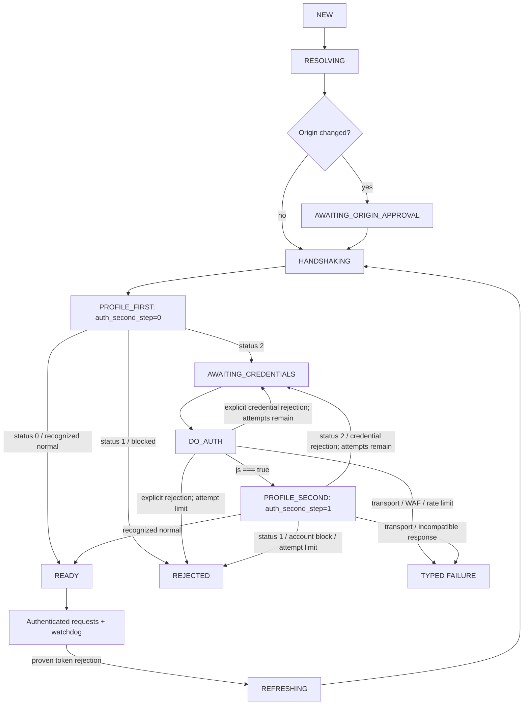

# Stalker Session Compatibility Foundation Design

## Status

Approved for specification on 2026-07-27.

This document defines Stage 1 of the Stalker/Ministra compatibility work. It
turns the authentication findings from the Stalker client audit into an
Electron-first runtime design. It does not authorize implementation until this
written specification has passed user review and a separate implementation plan
has been approved.

## Context

IPTVnator currently has two Stalker request paths:

- a stateless/simple `portal.php` path;
- a full-portal path whose handshake, token cache, profile calls, refresh, and
  watchdog are orchestrated in the Angular renderer while Electron main
  performs the HTTP request.

The full-portal path has correctness and ownership problems:

- it decides whether a portal is "full" from URL substrings rather than
  resolving the actual API endpoint;
- its first profile request incorrectly sends `auth_second_step=1`;
- it does not branch on profile status, so status `2` never performs the
  required `do_auth` followed by a second profile;
- the existing `do_auth` helper sends blank credentials and is unused;
- token state is renderer-owned while redirects and HTTP transport are
  main-owned;
- server-issued cookies are not retained in a real portal-scoped cookie jar;
- identity, transport, locale, and firmware fields do not form one coherent
  device profile;
- unsupported synthetic identity behavior, including a derived `__cfduid`, can
  make a portal reject or bind an account incorrectly;
- saved tokens are stale configuration rather than a trustworthy session;
- generic authentication errors hide whether failure occurred during endpoint
  discovery, device verification, credentials, portal protection, or account
  authorization;
- existing mocks exercise catalogs but do not accurately replay
  `get_profile`, status `2`, cookie rotation, redirect, or refresh behavior.

The desktop application is the first target because Electron main already owns
validated redirects, DNS pinning, native playback launch, and the process
boundary suitable for cookies and bearer tokens. The self-hosted PWA keeps its
current path during Stage 1. Pure protocol rules and fixtures remain reusable
for a later PWA backend adapter.

## Approved Product Decisions

1. Stage 1 is Electron-first. Existing PWA and simple-portal behavior must not
   regress, but full server-side PWA session parity is not an acceptance
   requirement.
2. The live full-portal session is owned by Electron main.
3. Pure resolver rules, auth transitions, response classification, session-key
   inputs, and profile presets live in a provider-scoped utility library.
4. Login and password fields are disclosed only when the portal returns profile
   status `2` or when the user explicitly expands the portal-login section.
5. New credentials are persisted only after `do_auth` and a successful second
   profile.
6. Stage 1 uses the existing playlist credential storage model. A secure
   Keychain/`safeStorage` migration belongs to a separate, cross-provider
   project rather than a Stalker-only vault.
7. Structured Xtream/Stalker credentials and optional/account-binding Stalker
   device identity beyond the required MAC are exported only after an explicit
   backup choice. The export choice is off by default.
8. Tokens, server cookies, handshake random values, leases, and challenges are
   never persisted.
9. The application does not invent serial numbers, device IDs, signatures,
   Cloudflare cookies, or opaque firmware hashes.
10. Identity profiles are stable and versioned. Failure never triggers
    automatic MAC, serial, firmware, or profile cycling.

## Goals

- Resolve root, landing, custom-prefix, `portal.php`, and `server/load.php`
  inputs safely.
- Select a tested `full-session` or `stateless-mac` request recipe without URL
  substring heuristics.
- Preserve the winning handshake and its server-issued cookie state.
- Implement the canonical profile status `0`/`1`/`2` state machine.
- Keep bearer tokens, handshake random values, and cookie jars in Electron
  main.
- Scope a live session to the actual portal and stable device identity rather
  than a playlist row.
- Serialize refresh so concurrent authorization failures produce one refresh
  generation and at most one retry per operation.
- Replace generic authentication failures with stable, stage-aware outcomes.
- Preserve simple Stalker and PWA request paths.
- Build sanitized replay fixtures before relying on new runtime behavior.
- Lazily upgrade existing full-portal playlists without a bulk rewrite.
- Establish an opaque playback-context seam so renderer code no longer builds
  secret Stalker `Cookie` or `Authorization` headers.

## Non-goals

- PWA backend session ownership or Electron/PWA full-auth parity.
- A secure credential vault or migration of Xtream credentials at rest.
- Catalog SQLite caching, offline-first catalogs, FTS, or last-good sync
  snapshots.
- Pagination redesign, page-size learning, repeated-page recovery, or partial
  catalog reconciliation.
- HTTP `462` recovery, previous-stream release, or a general playback-session
  lifecycle.
- Automatic device-emulation recipes or guessing opaque native MAG values.
- Capturing, storing, or publishing traffic from a portal the user does not
  own or control.

The cache and pagination work is Stage 2. Evidence-driven `create_link`, redirect,
HTTP `462`, and stream-release behavior is Stage 3.

## Considered Architectures

### Renderer-owned state machine

Angular would continue to own handshake, token, profile, and refresh while
Electron gained a cookie jar. This minimizes migration but leaves session state
split between processes. Atomic redirect validation, cookie mutation,
single-flight refresh, watchdog scheduling, and playback context cannot be
reasoned about as one unit. Tokens would remain visible to renderer code.

This option is rejected.

### Electron session manager with a pure protocol core

A provider-scoped pure library defines protocol rules. Electron main owns live
session state and HTTP. Angular becomes a facade over opaque leases and
challenges. The PWA retains its legacy adapter.

This is the selected design. It provides the correct process boundary without
making a new PWA backend a prerequisite.

### Shared host runtime for Electron and PWA

The complete stateful runtime could be shared between Electron and a web
backend through transport adapters. This offers strict parity but requires
server-side browser-session isolation, opaque web handles, process-affinity
semantics, and a credential contract outside this repository.

This remains a possible PWA follow-up, not Stage 1.

## Component Boundaries

### `libs/portal/stalker/protocol`

Create an Nx project with tags `scope:portal`, `domain:stalker`, and
`type:util`, exposed through a scoped path alias. It has no Angular, Electron,
Axios, Node HTTP, persistence, timer, or logging dependency.

It owns:

- URL normalization and versioned endpoint-candidate recipes;
- normalized profile status and body-error classification;
- pure auth state transitions;
- stable failure codes and operation stages;
- coherent, versioned identity/profile presets;
- canonical session identity input and identity-revision serialization;
- request parameter rules, including reserved auth parameters;
- fixture-facing protocol types that contain no runtime secrets.

It does not perform network requests, store state, or make UI decisions.

### `apps/electron-backend/src/app/services/stalker-session/`

Electron main owns the stateful runtime:

- `stalker-session-manager` owns the session registry, leases, generations, and
  single-flight work;
- `stalker-endpoint-resolver` performs bounded, validated discovery using the
  pure candidate rules;
- `stalker-http-session` integrates the cookie jar with every validated
  redirect hop;
- `stalker-auth-session` executes handshake, profile, optional `do_auth`, and
  refresh;
- `stalker-cookie-jar` owns managed bootstrap cookies and server `Set-Cookie`
  state;
- `stalker-challenge-registry` owns one-time origin and credential challenges;
- `stalker-watchdog` schedules profile-derived refresh checks only while a
  session is active;
- `stalker-playback-context` associates a successful `create_link` result with
  main-owned request headers without exposing them to Angular.

The cookie implementation must use a direct runtime dependency such as
`tough-cookie`. It must be integrated manually with the existing validated
redirect helper. `axios-cookiejar-support` must not replace or bypass the
current DNS-pinned agents and per-hop URL validation.

### IPC and preload

Add typed full-session operations:

- `STALKER_SESSION_OPEN`;
- `STALKER_SESSION_CONTINUE`;
- `STALKER_SESSION_REQUEST`;
- `STALKER_SESSION_CONTROL`.

Shared DTOs belong in `@iptvnator/shared/interfaces`. The IPC handlers validate
the payload at runtime, bind references to the sending `webContents`, and call
the session manager. The preload surface exposes only the typed operations.

The existing `STALKER_REQUEST` path remains for stateless/simple portals and the
legacy PWA adapter. Migrated Electron full-portal call sites cannot send raw
`handshake`, `get_profile`, or `do_auth` actions through the new request
operation.

### Angular Stalker data access

`StalkerSessionService` becomes a thin facade:

- convert playlist data into a typed connection descriptor;
- map a `full-session` playlist to an opaque `leaseRef`;
- expose origin-approval, credential, progress, ready, and failure outcomes;
- activate, deactivate, close, or force-redetect a lease;
- route full-portal catalog/search/detail/create-link operations through
  `STALKER_SESSION_REQUEST`;
- keep the current simple/PWA adapter available.

It does not own a token cache, handshake random, cookies, profile timers, raw
auth requests, or secret playback headers.

Provider stores and features continue to depend on Stalker data access rather
than Electron APIs directly.

### Import and settings UI

The Stalker import feature owns:

- connection progress;
- exact source/final origin confirmation;
- portal-login disclosure;
- masked password input with a reveal control;
- the advanced identity section;
- persistence after a confirmed ready outcome;
- lazy upgrade while importing or explicitly testing a connection.

The backup settings surface owns the explicit structured credential/device
identity export choice and its residual-sensitivity warning.

Challenges raised while opening an existing Stalker route are owned by a
route-level connection-flow service in `portal-stalker-feature`, not by the
import component. It presents the same origin/credential outcomes through
dialogs, coordinates lazy persistence with data access, and discards the
provisional attempt on cancel or route navigation. Stalker data access remains
UI-free.

### `tools/stalker-fixtures`

Create a Node-only Nx tool project named `stalker-fixture-tools`, tagged
`scope:tools`, `domain:stalker`, and `type:tool`. It owns the deterministic
fixture validator, fail-closed secret scanner, and local HAR-to-draft converter.
It is never imported by production renderer or Electron bundles.

## Session Identity, Leases, and Lifecycle

The internal live-session key is derived from:

```text
canonical API endpoint
+ normalized uppercase colon-delimited MAC
+ stable identity revision
+ confirmed principal discriminator
```

The identity revision is a canonical digest input containing:

- profile preset ID and version;
- explicit serial, device IDs, and signatures;
- effective User-Agent and X-User-Agent overrides;
- effective Referer and Origin policy/overrides;
- effective locale, language, timezone, and other identity-affecting profile
  overrides.

Playlist ID, source URL aliases, token, handshake random, cookies, account
information, and password are not part of the key. The principal discriminator
is `mac-only` for a status-0 session or a stable digest of the normalized
username confirmed by a successful status-2 flow. The raw username and password
are never map keys.

For this purpose, "normalized username" means the length-prefixed UTF-8 value
that was actually submitted and accepted. It is not trimmed, case-folded, or
Unicode-normalized, because a portal may treat those transformations as
different principals.

Discovery and authentication attempts are provisional and never join an
existing ready session. After network ready, the manager computes the
destination key from the confirmed principal but retains the session in the
attempt namespace. Only `commit` inserts or replaces it in the ready-session
registry. Two playlist rows may share a committed session only when endpoint,
MAC, identity revision, and principal all match. Rows with different usernames
never share a jar, token generation, or account summary.

The renderer receives a cryptographically opaque `leaseRef`, never the internal
session key. Each lease is bound to its creating `webContents` and playlist
facade instance. Two playlist rows resolving to the same session key may have
separate leases over the same session. Closing one lease does not break another.

Opening or testing edited endpoint, identity, or credential values creates a
separate provisional attempt and jar. It does not mutate the current local
session object. Some servers nevertheless rotate one token globally per MAC, so
client-side jar isolation is not sufficient. The manager therefore owns a
base-identity coordinator keyed only by approved portal origin and normalized
MAC. This intentionally serializes different profile revisions on the same
origin/MAC because the server may key its token only by MAC.

The coordinator tracks a monotonic mutation epoch, one wire-active principal,
and a read/write gate:

- requests for the current principal and epoch may run concurrently as readers;
- handshake, refresh, principal switching, and provisional authentication are
  exclusive mutations;
- a session whose recorded epoch or principal is no longer active is suspended
  and cannot send or refresh with stale auth state;
- an operation for a suspended principal first authenticates that principal
  under the exclusive gate, advances the epoch, then runs against the resulting
  generation before another principal can switch;
- only the wire-active principal owns a watchdog; inactive logical sessions
  retain their jar and accepted credentials in memory but do not create
  competing refresh traffic.

A provisional session may become stale while it waits up to two minutes for
local persistence, because an existing lease is allowed to switch the active
principal rather than freezing the application. `commit` therefore acquires the
exclusive gate and revalidates the provisional principal whenever its ready
epoch is no longer current before promoting it. `discard` restores or lazily
revalidates the previous active session. A failed revalidation after the draft
was persisted follows the existing `session-promotion-failed` recovery path.

If the destination session key already exists, commit atomically replaces its
auth generation, transfers all existing leases to the promoted session, and
invalidates old playback contexts; it never leaves two same-principal session
objects. Different principals remain separate logical sessions but switch
through the same base coordinator. This deliberately favors correctness over
parallelism for the unusual same-portal/same-MAC/multiple-account case.

Session lifecycle rules:

- `activate` starts or retains the profile-derived watchdog;
- `deactivate` stops activity attributable only to that lease;
- `commit` promotes a persisted provisional ready session;
- `discard` destroys a provisional attempt and restores/revalidates the prior
  ready session when necessary;
- `close` releases the lease;
- successfully committed identity, endpoint, principal, or credential changes
  invalidate the replaced auth generation;
- playlist deletion and renderer destruction release their leases;
- application shutdown destroys all jars and session state;
- Stage 1 keeps inactive sessions only for the current application process and
  does not persist or implement an additional idle cache.

## Endpoint Discovery

Discovery has two phases.

### Landing phase

The renderer supplies an HTTP(S) source URL and non-secret presentation
metadata. Electron normalizes the URL, rejects embedded basic-auth credentials
and credential/auth query keys such as `username`, `password`, `token`, `mac`,
`serial`, `device_id`, or `signature`, rejects unsupported schemes, and strips
the fragment. A non-sensitive landing query may be used for that landing
request but is never copied into derived API candidates. Electron performs the
validated landing request without:

- MAC;
- bearer token;
- login or password;
- serial, device ID, or signature;
- identity-specific cookies or headers.

Redirects are followed manually through the existing SSRF/DNS-pinning policy.
The existing five-hop redirect ceiling remains in force.

The landing phase owns an anonymous discovery jar. It may retain server cookies
set by the secret-free landing flow, but it never contains managed MAC cookies
or credentials.

If the final origin differs from the source origin, discovery returns an
`origin-approval-required` outcome before any identity-bearing probe. The
challenge is bound to the sender, exact source origin, exact final origin, and
the discovered landing path. It is single-use and expires after two minutes.

### Candidate phase

After the origin is trusted, a versioned recipe table derives at most six API
candidates:

1. an input URL that is already `portal.php` or `server/load.php`;
2. for a resolved `/c`, `/c/`, or `/c/index.*` landing, the parent
   `server/load.php`, then the parent `portal.php`;
3. for another resolved document/directory, same-directory
   `server/load.php`, then same-directory `portal.php`;
4. for a root landing only, the conventional
   `stalker_portal/server/load.php`, then `stalker_portal/portal.php`.

Duplicates are removed while preserving order. Candidates are evaluated
sequentially under the stateless downgrade guard below. Each candidate starts
with an isolated temporary cookie jar so a failed probe cannot poison another
candidate. The temporary jar receives only anonymous discovery cookies
applicable to that candidate URL; candidate mutations remain isolated.

A candidate probe is a MAC-only handshake after the origin has been approved.
It does not contain bearer authorization, password, or optional device
identity. Success requires:

- an allowed HTTP status;
- a content-type/body pair accepted by the response media policy;
- a valid handshake body containing a usable token;
- no classified portal-protection or body-level failure.

After a valid handshake, the same temporary session executes the first profile.
A recognized profile status or recognized status-less success proves a
`full-session` endpoint. Its handshake token, optional `random`, first-profile
result, endpoint, landing Referer, and temporary jar are promoted atomically.
The manager must not discard either response and repeat the handshake or first
profile.

A benign endpoint-shape failure may advance to the next candidate. A recognized
authorization, credentials, account/device, portal-protection, rate-limit, or
transport failure stops resolution and can never become evidence for a
stateless downgrade.

### Stateless recipe classification

A portal that explicitly does not support handshake/profile actions may still
be a valid stateless MAC portal. For each candidate, the resolver records a
stateless fallback only when:

1. the handshake or first-profile action is explicitly unsupported rather than
   rejected for authorization, credentials, account, identity, WAF, rate
   limit, or transport reasons; and
2. the existing read-only `type=itv&action=get_genres` capability probe returns
   a recognized `{ js: [...] }` simple-portal shape.

The probe occurs only after origin approval and may contain the managed MAC
identity, but never bearer authorization, credentials, or optional device
identity. Its temporary jar is discarded after classification.

The resolver continues through every later candidate looking for
`full-session`, even after recording a valid stateless fallback. It selects the
first recorded `stateless-mac` candidate only after every candidate has been
exhausted without full-session evidence and no candidate produced a failure
that forbids downgrade. Thus an early permissive `get_genres` response cannot
mask a later working `server/load.php` or `portal.php` full endpoint.

The selected recipe becomes part of the successful connection outcome.
`full-session` uses the new session manager; `stateless-mac` uses the preserved
simple request adapter. There is no stateless fallback after a full
authentication rejection. Existing simple playlist records remain on their
current adapter without being forced through a full-session migration.

If a previously learned endpoint returns `404`, HTML, or an incompatible body,
one secret-free rediscovery is allowed. No operation may perform more than one
rediscovery.

### Response media policy

All response classifiers normalize the media type to lowercase and ignore only
valid MIME parameters. Body-size enforcement happens before parsing.

- `application/json` and `text/json` accept JSON only;
- `application/javascript` and `text/javascript` accept JSON or the exact
  allowlisted JSONP envelopes;
- `text/plain` and a missing `Content-Type` may use bounded compatibility
  sniffing, but only an exact recognized JSON/JSONP envelope can become protocol
  success;
- every other type, including `text/html` and `application/octet-stream`, is
  ineligible for protocol success.

Actual HTML/WAF bodies are classified as portal protection when their evidence
is recognized. A syntactically valid JSON body mislabeled `text/html` is not
silently accepted: it is `incompatible-response` and may trigger the one
learned-endpoint rediscovery. The fixture matrix asserts these exact
distinctions.

## Cookie Ownership

Each live session has one in-memory RFC-aware cookie jar.

Managed bootstrap cookies are derived from the effective profile:

- `mac`;
- `stb_lang`;
- `timezone`.

Managed cookies override same-named server cookies. A server response cannot
shadow a managed name through a narrower Domain or Path: every `Set-Cookie`
mutation for `mac`, `stb_lang`, or `timezone` is discarded, regardless of its
attributes, and the manager materializes exactly one effective value for each
managed name at request time. Other server-issued `Set-Cookie` values are
retained with their Domain, Path, Secure, HttpOnly, expiry, and redirect-hop URL
semantics.

Rules:

- every response hop may mutate only the temporary or active jar that issued
  the request;
- before a cross-origin redirect, remove bearer authorization, Cookie, managed
  MAC/device parameters, X-User-Agent, SN, Origin, Referer, credentials, and
  every optional identity field;
- normalize the cross-origin `Location` with the same user-info, fragment, and
  credential/auth-query rejection used for source URLs; source-origin query
  secrets are never copied into target discovery;
- a cross-origin redirect discovered during an identity-bearing operation
  pauses that operation behind a new origin challenge; only secret-free
  discovery may continue far enough to identify the target;
- approving that target restarts endpoint resolution and authentication in a
  fresh candidate jar for the approved origin; it never replays the redirected
  handshake, profile, `do_auth`, or catalog request with source-origin
  credentials, bearer state, cookies, or optional identity attached;
- previously entered credentials may be submitted to the approved origin only
  after its own fresh profile returns status `2`;
- an unapproved origin never receives managed identity cookies;
- endpoint or identity invalidation destroys the jar;
- cookie state is never written to playlist data, backups, diagnostics, or
  local storage;
- the synthetic serial-derived `__cfduid` is removed;
- `SN` is not a default HTTP header and is available only as an explicit,
  versioned compatibility override.

## Coherent Identity Profiles

Stage 1 ships one automatic public-shape preset,
`mag250-public-5_1-minimal-v1`. It explicitly targets the public Stalker 5.1
request shape; it is not presented as an exact physical MAG250 fingerprint.
"Coherent" means every declared value describes that one shape, not that
unknown native fields are filled with guesses. The preset fixes:

- the existing
  `Mozilla/5.0 (QtEmbedded; U; Linux; C) AppleWebKit/533.3 (KHTML, like Gecko) MAG250`
  browser User-Agent as a named legacy compatibility value; public portal
  JavaScript does not establish this exact native browser UA, so the preset
  does not call it canonical;
- `X-User-Agent: Model: MAG250`, rather than copying the browser User-Agent into
  this model header;
- `stb_type=MAG250`, `client_type=STB`, and `hd=1`;
- metrics containing MAC, `model=MAG250`, and `type=STB`, plus handshake random,
  serial, and UID only when present or explicitly configured; UID is sourced
  only from the configured `device_id2`;
- the resolved landing Referer;
- one normalized locale/language/timezone tuple used consistently by
  `Accept-Language`, `stb_lang`, the timezone cookie, and the parameters
  declared by this versioned profile; it does not invent a generic `locale`
  field;
- session-derived `auth_second_step`, `not_valid_token`, and timestamp values.

Fields whose real values require native MAG APIs remain absent by default:
`ver`, `image_version`, `hw_version`, `hw_version_2`, `num_banks`, `video_out`,
device IDs, signatures, prehash, and `api_signature`. Omitting those keys,
rather than sending empty or zero pseudo-values, is an intentional safety
deviation from a physical 5.1 device request.

Public Stalker 4.9 and 5.1 profile shapes are not interchangeable. A strict 4.9
portal may require a complete firmware tuple that cannot be reconstructed from
the MAC. Such a portal uses an explicit traced/custom profile; the runtime does
not automatically retry a 5.1 failure with a synthetic 4.9 recipe. A future
automatic preset may add native-derived values only when one internally
coherent set is supported by a controlled fixture and documented evidence.

Primary references:

- [Stalker 5.1 device values and X-User-Agent construction](https://github.com/iptvhakr/stalker_portal/blob/72deceee1e32ea00cf33ecf2376b80902ab11134/c/xpcom.common.js#L565-L625);
- [Stalker 5.1 handshake, metrics, and profile request](https://github.com/iptvhakr/stalker_portal/blob/72deceee1e32ea00cf33ecf2376b80902ab11134/c/xpcom.common.js#L887-L953);
- [Stalker 4.9 profile request shape](https://github.com/iptvhakr/stalker_portal/blob/0eb23e4995222e7c3daa4b945a4e962703ebf0cc/c/xpcom.common.js#L909-L930);
- [Stalker 4.9 firmware/metrics validation](https://github.com/iptvhakr/stalker_portal/blob/0eb23e4995222e7c3daa4b945a4e962703ebf0cc/server/lib/stb.class.php#L533-L552).

Advanced identity values are explicit user configuration. Blank serial,
device-ID, signature, and prehash fields are omitted rather than generated.
The runtime forwards explicit values unchanged in the protocol locations
defined by the selected profile.

The runtime does not:

- derive device IDs from a MAC;
- use `SHA1(MAC)` as a universal prehash;
- invent opaque firmware/device signatures;
- rotate profile presets after rejection;
- infer a serial from a MAC;
- synthesize Cloudflare cookies.

Existing playlists with explicit values are mapped to a stable custom profile
revision. Existing blank values remain absent.

## Authentication State Machine



Profile statuses accept numeric and string forms. Status `0` is ready, status
`1` is rejected or blocked, and status `2` requires credentials. A missing
status is accepted only for a recognized profile-shaped success response with
no credential, block, or body-error indicators. Unknown status values are
`incompatible-response`.

The first profile always sends `auth_second_step=0`. `do_auth` is legal only
after status `2`. A second profile is legal only after canonical `do_auth`
success and always sends `auth_second_step=1`. A successful `do_auth` response
alone never marks the session ready. Canonical success requires the normalized
response to contain `js === true`; other shapes require an explicit fixture and
classifier rule rather than JavaScript truthiness.

`do_auth` contains login/password plus only the explicit device identity fields
defined by the active profile. Blank device IDs or signatures remain absent,
and the second profile reuses the identical identity revision.

For an existing playlist with saved credentials, Angular may answer the
credential challenge automatically after the trusted endpoint is known. A new
or edited password is sent only through `STALKER_SESSION_CONTINUE`. It is
persisted only after the second profile reaches ready. A failed replacement
does not overwrite previously stored credentials.

Each credential submission consumes its one-time challenge. An explicit
credential rejection returns a fresh challenge over the same trusted endpoint
and candidate jar, up to three submissions per connection attempt. Rejection of
saved credentials expands the login form. A fourth submission requires a new
connection attempt and returns `credentials-attempt-limit`.

Timeout, DNS/TLS/network failure, WAF response, `429`, or `5xx` during
`do_auth` is not a credential rejection. It keeps stored credentials unchanged
and returns its transport/protection outcome. `429` terminates the attempt and
honors `Retry-After`; other retryable failures may restart through the normal
open flow without reusing a consumed challenge.

After ready, Electron may retain the accepted credentials in that in-memory
session only so a later status-2 refresh can complete without another UI
round-trip. The copy is cleared with the session, is never part of its key, and
is never logged or persisted by Electron.

The handshake token has no invented TTL. IPTVnator does not persist it even if
the profile advertises `store_auth_data_on_stb`; protected token persistence is
outside Stage 1.

## Refresh and Watchdog

A request can trigger refresh only from proven token-rejection evidence:

- HTTP `401`;
- an exact supported HTTP-200 `Authorization failed` body/envelope;
- a `403` response classified as token-auth rejection rather than WAF or
  account denial.

`Access denied`, status `1`, WAF-style HTML, `429`, network errors, and `5xx`
responses do not rotate the token.

Refresh is generation-aware and single-flight:

1. the first failing operation invalidates the current auth generation;
2. concurrent failures join the same refresh promise;
3. refresh reruns the canonical handshake/profile flow;
4. the refreshed flow must confirm the same principal discriminator;
5. the original operation retries once against the new generation;
6. another rejection is terminal for that operation.

There is no recursive refresh path.

The principal discriminator of a committed session is immutable. If a
protocol-valid refresh resolves a different discriminator, or a `mac-only`
session reaches status `2` before the committed principal can be reconfirmed,
the manager does not re-key in place and does not retry the original operation.
It discards that refresh result and returns
`principal-transition-required`. The base coordinator advances its epoch,
enters a no-active-committed-principal transition state, and suspends old leases
so none can send the now-stale generation. The route-level connection flow
opens a provisional replacement, handles status `2` if necessary, persists it,
and commits through the normal collision/coordinator path. A transition to
`mac-only` does not silently erase stored credentials. This keeps lease,
account-summary, jar, and session-key ownership atomic.

A status-2 refresh for an existing username principal may use its retained
credentials or a challenge constrained to that exact username. Submitting a
different username is a provisional principal change, not an in-place refresh.
Transport, protection, rate-limit, and incompatible-response failures retain
their own typed outcomes and never become `principal-transition-required`.

The watchdog runs in Electron main, not Angular. Its interval is derived from
recognized profile fields and clamped to safe minimum and maximum bounds with
jitter. Invalid or missing values use one documented conservative default.
Watchdog authorization failure joins the same refresh mechanism. Other
watchdog failures are classified and surfaced without silently changing
identity.

## IPC Contract

### Open

`STALKER_SESSION_OPEN` accepts a connection descriptor containing:

- playlist reference used only for facade correlation;
- connection mode: persisted-open or provisional import/edit/migration;
- source URL and optional learned endpoint hint;
- normalized MAC;
- selected profile preset and explicit overrides;
- non-secret transport configuration.

It returns one discriminated outcome:

- `ready` with the resolved endpoint and selected recipe; provisional outcomes
  include an opaque `attemptRef`; `full-session` also includes `leaseRef`, safe
  account summary, and capabilities, while `stateless-mac` carries a
  persistence draft but no session lease;
- `origin-approval-required` with an opaque challenge and display-safe origins;
- `credentials-required` with an opaque challenge;
- `failure` with a stable reason, stage, retryability, and request ID.

### Continue

`STALKER_SESSION_CONTINUE` accepts an opaque challenge and exactly one response:

- approval or rejection of the displayed final origin; or
- login/password for a credential challenge.

Challenges are sender-bound, single-use, expire after two minutes, and are
invalidated when their connection attempt terminates.
Continuation returns the same `ready`, next-challenge, or `failure`
discriminated outcome family as open.

### Request

`STALKER_SESSION_REQUEST` accepts:

- a sender-bound `leaseRef`;
- a typed application operation;
- operation-specific, non-reserved parameters.

The renderer cannot supply or override:

- token, prehash, `auth_second_step`, login, or password;
- handshake/profile/do-auth actions;
- managed MAC, cookie, identity, locale, or firmware fields;
- raw Authorization or Cookie headers.

The manager constructs the wire request from the active session.

The return value is either a sanitized typed operation result, the same
origin/credential challenge shape used by open, or a typed failure. A challenge
terminates the current application operation; main does not retain or
implicitly replay its catalog/search/playback parameters. Continuation may
produce a provisional `ready` outcome for the replacement session. After the
route-level flow persists and commits that outcome, the Angular facade may
reissue the original typed operation once under the same explicit retry budget.
A refresh that newly reaches status `2` from a `mac-only` session does not use
this in-place continuation path: it returns
`principal-transition-required`, starts the route-level provisional reconnect,
and reissues the operation only after persistence and commit.

### Control

`STALKER_SESSION_CONTROL` supports:

- `activate`;
- `deactivate`;
- `commit`;
- `discard`;
- `close`;
- `force-redetect`.

References are never accepted from a different renderer and are not logged.
`commit` is accepted only after the renderer reports that the corresponding
playlist draft was persisted successfully. A ready provisional attempt may
remain for two minutes while the UI retries a failed local save. `discard` is
mandatory on cancel, navigation, expiry, or abandonment of that retry.

## Playback Context Seam

Full-portal `create_link` runs through the session manager. On success, Electron
main records the effective session-owned headers against the exact returned
stream and its bounded playback context. The renderer receives the stream URL,
safe presentation metadata, and, when needed, an opaque playback context
reference. It does not receive bearer or cookie headers.

The context is bound to the creating renderer, lease, session key, auth
generation, and exact normalized stream URL. An unclaimed reference expires
after two minutes. A successful authorized main-process launch consumes the
reference; refresh, lease close, renderer destruction, endpoint change, or
identity change invalidates it first. Advancing the base-identity mutation
epoch, including a switch to another principal on the same MAC, invalidates all
unclaimed contexts under that coordinator. The native player may retain the
resolved headers for that launched playback, but they never return through
preload.

The external MPV/VLC and Embedded MPV launch paths resolve the context in main.
Renderer playback metadata may still contain non-secret User-Agent, Referer,
and Origin values needed by existing player abstractions.

Stage 1 removes the current renderer call to `getCachedToken()` and stops
constructing synthetic Stalker playback cookies in data access. It preserves
current successful playback behavior but does not add HTTP `462`, previous
stream release, or general playback-session recovery. Those require Stage 3
fixtures.

## Persistence Model

### User-owned configuration

Playlist storage keeps:

- `stalkerSourceUrl`, the URL entered by the user;
- MAC;
- selected profile preset ID;
- explicit serial/device/signature/profile and transport overrides;
- username/password after confirmed authentication;
- existing portable user state.

### Learned non-secret hints

After a complete ready outcome, local playlist storage may update:

- `portalUrl`, the last verified canonical API endpoint retained for current
  consumer compatibility;
- `stalkerLandingUrl`, the resolved landing URL used for Referer behavior;
- `stalkerRequestRecipe`, exactly `full-session` or `stateless-mac`;
- `stalkerRecipeClassifierVersion`, the version that established that recipe;
- the last verified timestamp;
- safe account summary already supported by the playlist model.

Learned hints are performance hints, never proof of trust. They are revalidated
before identity-bearing traffic and may trigger one secret-free rediscovery.

### Ephemeral state

The following remain in Electron memory only:

- bearer token and handshake random;
- server cookies;
- accepted credentials needed for an authenticated status-2 refresh;
- leases and challenges;
- refresh generations and pending promises;
- watchdog state;
- active playback contexts.

## Backup Contract

Stage 1 keeps backup manifest version 1 and adds optional fields
backward-compatibly. Existing version-1 manifests remain importable. The
Stalker connection adds:

- source URL;
- profile preset ID and version;
- portable non-secret profile/transport overrides, including User-Agent,
  Referer, Origin, locale, language, and timezone settings;
- the existing compatibility `portalUrl`, MAC, and `isFullStalkerPortal`
  fields.

Restore prefers source URL and resolves the endpoint again. Learned landing,
request recipe/classifier version, account summary, and runtime session state
are not restored as authoritative state.

The export UI adds an explicit
`Include portal credentials and device identity` choice, off by default. When
enabled, it includes:

- structured Xtream/Stalker usernames and passwords;
- explicit Stalker serial, device IDs, signatures, prehash/native hash values,
  and custom firmware identity tuple.

The manifest `includeSecrets` value reflects this choice. A manifest declaring
`includeSecrets=false` but containing one of those gated fields is rejected
rather than silently trusting inconsistent metadata.

The version-1 Xtream connection currently requires a username, so redaction
needs an explicit additive shape rather than an invalid half-entry. A new
version-1 writer uses these conditional rules:

- with `includeSecrets=true`, Xtream keeps its existing non-empty username and
  optional password shape;
- with `includeSecrets=false`, Xtream omits both fields and writes
  `credentialsOmitted: true` beside the non-secret server URL;
- a missing Xtream username is valid only in that exact redacted form; old
  version-1 entries remain valid and unchanged.

On restore, a redacted Xtream entry never creates an unusable playlist. If its
`exportedId`, portal type, and normalized server URL identify the same existing
local playlist, restore preserves that playlist's local credentials and applies
the backed-up user state. Otherwise the backup UI creates an in-memory pending
restore item, collects username/password, validates them through the normal
Xtream connection flow, and only then creates or matches the playlist and
applies its pending user state. Skipping the prompt reports that entry as
skipped; it does not persist a credential-less Xtream row. Server URL alone is
never enough to merge two redacted Xtream accounts.

MAC, portal/source URL, non-secret transport overrides, and raw M3U content are
not controlled by this checkbox. They can still be sensitive. Raw M3U content
can itself contain signed or private URLs and is the canonical restore artifact.
Stage 1 does not rewrite raw M3U text. The export UI therefore warns precisely
that the file still contains playlist MACs, hosts/source URLs, and potentially
private raw M3U URLs even when structured account-binding secrets are excluded.

Restoring a Stalker entry without credentials is valid. Unlike Xtream, its MAC
is already the primary connection identity; if the resolved portal returns
status `2`, the normal credential challenge collects the omitted login and
password.

Merge semantics are patch-like:

- with `includeSecrets=false`, omitted gated fields preserve an existing local
  value; they remain absent on a newly created Stalker playlist, while a new
  Xtream entry follows the pending-credential flow above;
- with `includeSecrets=true`, a present field replaces the local value, an
  explicitly present empty string clears it, and an omitted field preserves an
  existing value. Provider-required fields such as an included Xtream username
  must still pass provider validation and cannot be cleared to an unusable
  value.

New Stalker backup matching uses normalized source URL, normalized MAC, profile
preset plus explicit identity fingerprint, and username when present, using the
same exact principal normalization defined for the session key. Password is
never part of a fingerprint. The legacy `portalUrl + MAC` fingerprint may match
a new entry only when it identifies exactly one existing playlist; an ambiguous
legacy match creates a separate restored entry rather than merging two
device/account profiles.

When credentials are excluded, backup entries that become identical only
because usernames were removed remain distinct through their exported entry
identity. A secret-stripped Stalker entry may preserve local credentials only
on an exact `exportedId` plus source/MAC/profile match; otherwise it creates a
separate credential-less entry. Restore must not deduplicate two
secret-stripped entries on the reduced fingerprint. `exportedId` remains
non-secret and must be non-empty and unique within the manifest; a duplicate is
rejected before any restore mutation.

## Lazy Migration

There is no startup or bulk database migration.

- New Electron imports use the resolver by default.
- An existing full-portal playlist upgrades on first open or Test Connection.
- If `stalkerSourceUrl` is absent, the existing `portalUrl` becomes the source
  input; if that is absent, the legacy `url` field is used.
- Learned fields and edited credentials are committed only after ready.
- A failed connection leaves the stored playlist unchanged.
- `isFullStalkerPortal` remains a deprecated compatibility hint but no longer
  selects the auth algorithm; successful recipe classification derives its
  compatibility value for existing consumers.
- `stalkerToken` is ignored immediately, is never written by the new path, and
  is removed when a playlist is successfully upgraded.
- Existing explicit identity values are preserved; blank values are not
  generated.
- Stateless/simple portal records continue to use the current request path.
- PWA continues to use its existing adapter and existing regression tests.

On the next Electron open, `full-session` invokes the session manager and
`stateless-mac` invokes the simple adapter. For a legacy full or ambiguous
Electron record, a missing recipe triggers lazy reclassification. An explicitly
simple legacy record stays on the simple adapter unless the user invokes Test
Connection, edits its connection identity, or an endpoint-shape failure
requires reclassification. An older classifier version, changed source/endpoint
input, or a classified endpoint-shape failure also triggers reclassification
for an otherwise eligible Electron record. PWA continues to read the derived
legacy `isFullStalkerPortal` value until it gains its own request-recipe
contract.

There is no silent fallback from a failed new full-auth state machine to the
known-incorrect legacy full-auth sequence. Failures remain typed and
actionable. The unchanged simple-portal path is the compatibility path for
portals that do not require a full session.

## Error Taxonomy

Every failure has a stable reason, operation stage, retryability, and request
ID. User-facing text is translated separately from the reason code.

| Signal                                                         | Outcome and action                                                               |
| -------------------------------------------------------------- | -------------------------------------------------------------------------------- |
| Invalid URL, embedded basic auth, or unsupported scheme        | `invalid-url`; stop before network                                               |
| Invalid MAC format or oversized identity field                 | `invalid-identity-input`; stop before network                                    |
| Redirect ceiling or repeated redirect target                   | `redirect-loop`; stop before an identity-bearing probe                           |
| No valid bounded candidate                                     | `endpoint-not-found`; preserve input                                             |
| Cross-origin challenge rejected or expired                     | `origin-not-approved`; stop before identity probe                                |
| DNS lookup failure                                             | `dns-failure`; transient, keep stored state                                      |
| Connection/network failure                                     | `network-unreachable`; transient, keep stored state                              |
| Request timeout                                                | `request-timeout`; transient, keep stored state                                  |
| TLS validation/handshake failure                               | `tls-failure`; keep stored state and do not offer an insecure bypass             |
| Profile status `1` or recognized block field                   | `account-or-device-blocked`; never cycle identity                                |
| Recognized device-ID/signature mismatch                        | `device-identity-conflict`; preserve configured identity for explicit correction |
| Profile status `2`                                             | `credentials-required` challenge                                                 |
| Explicitly failed `do_auth` or second profile still status `2` | fresh `credentials-required` challenge; do not persist edited credentials        |
| Three rejected credential submissions                          | `credentials-attempt-limit`; require a new attempt                               |
| HTTP `401` or proven token rejection                           | one serialized refresh and one operation retry                                   |
| Refresh resolves a different principal                         | `principal-transition-required`; provisional reconnect, never in-place re-key    |
| Rejection after that retry                                     | `auth-refresh-exhausted`; stop without recursion                                 |
| HTTP-200 `Access denied`                                       | `account-access-denied`; no token refresh                                        |
| HTML/WAF `403`                                                 | `portal-protection-blocked`; no token or identity rotation                       |
| Learned endpoint returns `404`, HTML, or wrong content type    | one secret-free rediscovery                                                      |
| HTTP `429`                                                     | `rate-limited`; stop candidate probes and honor a valid `Retry-After`            |
| HTTP `5xx`                                                     | `portal-unavailable`; no state mutation beyond the failed request                |
| Response exceeds its operation cap                             | `response-too-large`; do not partially parse                                     |
| Unsupported success/body/status shape                          | `incompatible-response`; preserve sanitized diagnostics                          |
| Atomic playlist write fails                                    | `local-persistence-failed`; retain bounded provisional attempt for save retry    |
| Runtime promotion fails after persistence                      | `session-promotion-failed`; discard runtime draft and reopen persisted config    |

An operation has a budget of one rediscovery, one auth refresh, and one retry.
Budgets are explicit state, not recursive calls.

Requests retain the existing validated redirect ceiling and finite timeouts.
Resolver/auth responses and catalog responses receive separate finite body-size
limits appropriate to their operation. A size limit produces
`response-too-large`; content is not partially parsed.

## User Experience

The import and reconnection flow exposes these stages:

1. Resolving portal
2. Waiting for origin approval, when required
3. Verifying device
4. Credentials required, when required
5. Validating credentials
6. Saving connection
7. Connected

The form stays open and retains its values and current safe discovery context
after failure. Entering credentials continues the same trusted attempt rather
than restarting discovery.

The origin prompt displays the exact source and final origins and explains that
the MAC will be sent only after approval. The credential section is collapsed
until requested, uses a masked password with a reveal control, and does not
clear stored good credentials after a failed replacement.

Serial, device IDs, signatures, and profile overrides live in a collapsed
advanced section. The UI does not imply that guessed values improve
compatibility.

New imports are persisted only after ready. An existing playlist stays
unchanged after connection failure. Network ready is provisional: the UI first
writes the complete playlist draft atomically, then calls session `commit`, and
only then shows Connected.

A failed local write produces `local-persistence-failed` and offers Save Again
against the same provisional ready attempt for up to two minutes. It does not
claim that credentials or learned endpoint data were saved. Cancel, navigation,
or expiry calls `discard`, closes the provisional lease, and restores or
revalidates the previous ready session. `commit` is idempotent; if promotion
fails after a successful write, the UI returns `session-promotion-failed`,
discards the provisional runtime state, and may reopen from the now-persisted
record.

Stage 1 does not add a "save rejected credentials anyway" path.

## Diagnostics and Privacy

Runtime diagnostics may contain:

- stage and stable reason code;
- recipe and profile preset IDs;
- HTTP status class and content type;
- redirect and candidate counts;
- bounded duration;
- request ID;
- a sanitized body-shape classification.

Diagnostics and logs must not contain:

- bearer token or handshake random;
- MAC or credential values;
- cookie names paired with values;
- serial, device IDs, or signatures;
- lease/challenge references;
- URL credentials or query secrets;
- raw response bodies;
- raw portal catalog metadata.

All Electron and renderer logs pass through the existing redacting portal/shared
logging utilities. The fixture sanitizer is stricter than runtime log
redaction; runtime redaction alone is not sufficient to publish a fixture.

## Fixture and Replay Design

The existing catalog mock remains available. A separate stateful replay mode is
added to `stalker-mock-server`.

The server exposes an application factory so tests can start it on an ephemeral
port without importing a side-effectful `main` entry point.

A test creates an isolated replay run from a repository fixture and receives:

- an opaque `runId`;
- a synthetic entry URL;
- a run-generated, locally administered synthetic MAC and any explicit device
  fields required by the scenario;
- synthetic credentials when the scenario needs them.

The scenario identity is carried by the run URL. The generated MAC is only a
protocol input and cannot select or share a scenario. Parallel tests have
independent state.

Each fixture is deterministic JSON with:

- schema version and scenario ID;
- named virtual origins, where distinct aliases map to distinct ephemeral
  loopback listeners;
- entry/landing definition;
- ordered phases;
- request method and path;
- exact/present/absent query and header matchers;
- a discriminated request-body matcher;
- cookie attribute and presence matchers;
- an explicit response union;
- state transition and request cardinality;
- expected endpoint and terminal state;
- a fail-on-unexpected-request policy.

Every response has an integer status and a lower-case header map whose values
are always arrays. This preserves repeated `Set-Cookie` fields and represents
`Location`, `Retry-After`, and `Content-Type` without special lossy handling.
Its body is exactly one member of this discriminated union:

- `empty`, for responses with no body;
- `json`, containing a schema-validated JSON value;
- `jsonp`, containing an allowlisted callback shape and JSON value;
- `text`, for bounded raw text or synthetic HTML;
- `generated`, for a bounded deterministic byte pattern used to cross a
  runtime response-size limit without committing a large blob.

The request-body matcher is exactly one of `absent`, `json`, `form`, or `text`.
JSON and form matchers support exact/present/absent fields and typed references;
text requires an exact bounded value. GET-based Stalker recipes declare
`absent`, so a redirect test cannot accidentally ignore identity or credential
fields moved from the query into a body.

Fixture values use typed symbol nodes. A `generate` node creates a safe,
run-scoped locally administered MAC, test credential, opaque token, random
value, cookie value, or request correlation value; a `ref` node requires the
exact previously generated value. Composite headers and cookies use a validated
`parts` node made only from fixed literals and typed references. Free-form
string interpolation and substring matching of secrets are forbidden. This
lets a fixture prove that a server-issued value is reused exactly without
storing a realistic static secret.

Concurrency is represented by a phase that permits explicitly bounded,
order-independent application requests. A deterministic barrier such as
`releaseWhenMatched: 2` may hold matching responses until both original
operations have reached the token-rejection phase. Auth transitions remain
ordered. The ledger then proves that the manager created one refresh
generation and that each original operation was retried exactly once.

The replay ledger records only action names, counts, sanitized mismatch codes,
safe fixture operation labels, and terminal state. It never records request
secrets.

The run lifecycle is explicit:

1. `create` validates an allowlisted fixture and allocates isolated listeners,
   symbols, ledger, and expiry;
2. the test exercises the returned entry URL;
3. `finalize` fails if a cardinality is unmet, an unexpected request occurred,
   a barrier remains blocked, or the expected terminal state was not reached;
4. `dispose` closes all listeners and erases the run even after test failure.

Fixture JSON is capped at 1 MiB, a scenario at 128 phases and 512 expectations,
a run at 512 requests, and generated response data at 16 MiB. A run has a
ten-minute hard lifetime and a two-minute inactivity timeout. These are
schema-owned constants with boundary tests.

Unit/integration tests call the application factory in process. If an Electron
E2E test needs an HTTP control plane, it is a separate loopback-only listener,
validates the Host header, has no CORS support, accepts only repository
allowlisted fixture IDs, caps control bodies at 64 KiB, and requires a random
process-local capability for every create/finalize/dispose call. The capability
is given only to the test harness and never appears in the synthetic portal
URL.

Named origins provide real cross-origin semantics through different loopback
ports. Cookie rules that require HTTPS, registrable domains, public-suffix
checks, or an exact clock are tested against the injected cookie adapter using
synthetic `https://` URLs and a fake clock; the replay server does not weaken
TLS verification or install a test CA.

### Required Stage 1 scenario matrix

Unless a case is explicitly assigned to an injected transport, cookie-adapter,
or fake-clock suite below, it is a committed replay fixture.

Resolver:

- root and `/c/`;
- custom-prefix `/c/`;
- direct `portal.php` and `server/load.php`;
- explicit stateless MAC classification after unsupported auth actions;
- an early stateless-capable candidate followed by a later full-session
  candidate, with full-session winning;
- an auth/protection failure after recorded stateless evidence, with downgrade
  forbidden;
- relative same-origin redirect;
- approved and rejected cross-origin redirect;
- redirect loop;
- HTML/`404` candidate before a valid endpoint.

Cross-origin redirect security:

- landing, handshake, first/second profile, `do_auth`, and catalog redirects
  each pause before the target listener receives an identity-bearing request;
- rejection produces zero target-origin identity requests;
- approval restarts against the target origin with a fresh candidate jar,
  rather than forwarding source-origin MAC cookies, bearer authorization,
  credentials, optional identity, or identity query/body fields;
- a target `Location` containing user-info or a credential/auth query key is
  rejected before target traffic;
- credentials are reused only if the target origin independently reaches
  status `2`.

Authentication:

- handshake with and without `random`;
- profile status numeric/string `0`, `1`, and `2`;
- recognized success without status;
- successful and failed `do_auth`;
- rejected saved credentials followed by a successful fresh challenge;
- three rejected submissions reaching the attempt limit;
- transport/WAF/rate-limit failure during `do_auth` remaining distinct from bad
  credentials;
- second profile permitted only after successful `do_auth`;
- `store_auth_data_on_stb` true and false without token persistence.

Classifier near misses:

- `do_auth` bodies containing `js: 1` or `js: "true"` producing
  `incompatible-response`, while `js: false` is an explicit credential
  rejection and returns a fresh bounded challenge;
- unknown profile status values and status-shaped fields in an unsupported
  envelope producing `incompatible-response`;
- ambiguous `403` bodies that match neither token rejection nor WAF evidence,
  producing `incompatible-response` without refresh;
- noncanonical variants of `Authorization failed`, producing
  `incompatible-response` rather than a token rotation;
- malformed JSONP, valid JSON labeled `text/html` producing
  `incompatible-response`, and an oversized generated response.

Identity and cookies:

- blank optional identity fields absent;
- explicit values forwarded unchanged;
- coherent profile headers/metrics;
- Set-Cookie, rotation, expiry, Secure, Domain, and Path;
- duplicate same-name cookies, redirect-hop cookies, and refresh rotation;
- attempted server shadowing of managed cookies through narrower Path/Domain;
- public-suffix Domain rejection and fake-clock expiry;
- failed-candidate jar poisoning prevention and atomic winning-jar promotion;
- isolation between two portal identities;
- two playlist leases with the same confirmed principal sharing one session;
- two usernames on the same endpoint/MAC/identity remaining isolated;
- alternating requests for those two principals switching under one
  base-identity coordinator without interleaved token generations;
- same-principal commit collision transferring existing leases atomically;
- an old-session refresh while a successful provisional attempt awaits save,
  followed by revalidation at promotion;
- failed provisional edit followed by restoration of the previous ready
  session;
- identity revision invalidating the jar.

Errors and refresh:

- `401`;
- token-auth `403`;
- WAF/HTML `403`;
- `404` and wrong content type;
- `429` and `Retry-After`;
- `5xx`;
- HTTP-200 `Authorization failed`;
- HTTP-200 `Access denied`;
- refresh from username principal to `mac-only`, requiring provisional
  replacement rather than in-place re-key;
- refresh from `mac-only` to status `2`, requiring a credential/reconnect flow;
- concurrent failures joining exactly one refresh.

DNS failure, connection reset, timeout, and TLS failure use an injected
transport with deterministic errors rather than pretending that a loopback
HTTP fixture can reproduce those operating-system conditions.

Catalog pagination fixtures remain in the existing catalog scenario system.
HTTP `462` and stream-release fixtures are deferred to Stage 3.

## Capture-to-Fixture Safety

A local developer tool may convert a HAR captured from a user-owned or
controlled portal into a draft fixture. Raw captures must stay outside the
workspace, git history, CI artifacts, and support attachments.

The converter:

- resolves and inspects the input with no-follow semantics, rejects symlinks
  and non-regular files, and rejects any raw input whose real path is inside a
  repository worktree;
- enforces raw-byte, decoded-byte, string, collection, and nesting-depth limits
  before materializing untrusted nested content;
- strictly decodes HAR `encoding: base64` content or rejects it, and applies
  decoded-size limits before parsing the result;
- structurally parses URLs, query parameters, headers, cookies, and JSON;
- replaces origins, MAC, credentials, tokens, cookies, serial/device/signature
  values, account IDs, artwork, stream URLs, and unique provider metadata with
  typed placeholders;
- preserves only protocol-relevant status, content type, redirect shape, cookie
  attributes, and body structure;
- scans raw, URL-encoded, double-encoded, and JSON-escaped forms;
- rejects unknown external origins, JWT/MAC/cookie literals, suspicious
  high-entropy strings, oversize values, invalid schema, and non-deterministic
  timestamps;
- exposes only stable sanitized error codes, never offending raw values;
- validates the complete generated fixture in memory before writing;
- emits deterministic, formatted JSON through an exclusive temporary regular
  file and atomic rename, rejecting a symlink or non-regular output target.

A second fail-closed validator runs in tests and CI over every committed
fixture. Regex replacement of a few known values is insufficient.

## Test Ownership

### Unit and integration

- `portal-stalker-protocol`: candidate recipes, profile normalization, pure
  transitions, response classifier, reserved parameters, and identity
  revision.
- `stalker-mock-server`: fixture schema, replay transitions, cardinality, run
  isolation, request-body matching, symbol binding, barriers, lifecycle
  finalization, resource caps, control-plane authorization, ledger sanitization,
  and unexpected-request failure.
- `stalker-fixture-tools`: structural capture conversion, deterministic
  formatting, input/output path safety, bounded/base64 parsing, placeholder
  validation, encoded-secret scans, entropy checks, and fail-closed behavior.
- `electron-backend`: cookie semantics, validated redirect integration,
  challenge binding/expiry, session leases, generation invalidation,
  principal isolation, base-identity read/write arbitration, same-principal
  lease transfer, provisional promotion/rollback and promotion-time
  revalidation, immutable-principal refresh transitions, single-flight refresh,
  response limits, and playback context. Direct boundary tests reject malformed
  or reserved IPC input and scan every returned DTO for token, random, cookie,
  credential, and identity leakage. Injected-transport tests cover
  DNS/network/timeout/TLS classification.
- `electron-backend` fake-clock suites prove watchdog activation, interval
  clamp/jitter, last-lease deactivation, renderer destruction, joining an
  in-flight refresh, and context invalidation. Playback contexts are bound to
  sender, session, generation, and exact stream URL; expire and are
  single-purpose; and become unusable after refresh, lease close, endpoint
  change, or identity change.
- `portal-stalker-data-access`: Electron facade outcomes, simple/PWA adapter
  preservation, migrated request routing, and absence of renderer token cache.
- `portal-stalker-feature`: route-level origin/credential dialogs, first-open
  lazy migration, request-time reconnection followed by one facade reissue,
  cancellation/navigation cleanup, and persistence retry.
- `playlist-import-feature`: progress states, origin approval, status-2
  disclosure, successful credential persistence, failed credential
  preservation, and lazy migration.
- `services`: backup with structured credentials included/excluded, source URL,
  identity-secret gating, redacted Xtream conditional validation/pending state,
  patch-style merge semantics, version-1 compatibility, and round trip.
- `web`: backup export-choice presentation, residual-sensitivity warning, and
  secret-included/secret-excluded import behavior, including the redacted
  Xtream credential prompt and skip result.
- `shared-logging`: Stalker session payload and diagnostic redaction.

### Electron E2E

Add atomized Electron E2E coverage:

1. `stalker-auth.e2e.ts` covers root/custom-path discovery, status `2`, cookie
   rotation, successful second profile, catalog request, and playback-context
   registration;
2. the same file covers parallel token rejection, one refresh, cookie/session
   isolation, and a successful retried request;
3. the same file covers first open of an existing legacy full-portal playlist,
   route-level credential flow, saving, promotion, and reopen through the
   persisted recipe;
4. `backup-roundtrip.e2e.ts` proves the default secret exclusion, explicit
   secret inclusion, redacted Xtream prompt/skip behavior, patch-style restore
   semantics, and residual-sensitivity warning.

Keep the existing Electron provider smoke and PWA Stalker E2E as regression
gates for stateless/simple behavior.

No real portal is used in CI.

## Implementation Sequencing

The implementation plan should preserve these dependency-ordered slices:

1. **Evidence and pure contracts:** fixture schema/validator, replay server
   support, protocol utility project, and state-machine/classifier tests. This
   slice changes no production connection behavior.
2. **Electron runtime:** direct cookie-jar dependency, validated redirect
   integration, session manager, challenges, IPC/preload contracts, refresh,
   watchdog, and playback-context ownership.
3. **Renderer cutover:** Angular facade, all full-portal call sites, import UX,
   lazy persistence, backup choice, removal of renderer token/header
   construction, Electron E2E, canonical docs, and release note.

No partial slice may advertise the new full-session behavior before its
security-boundary and regression tests pass. The final cutover is atomic from a
user perspective. Simple/PWA behavior remains available throughout.

`portal-stalker-protocol`, `stalker-fixture-tools`, and any new atomized test
targets named below are implementation deliverables, not assumed existing
projects. Their `project.json` files must include repository-standard
scope/domain/type tags. The implementation also classifies the new test
projects and newly test-enabled tool projects in
`tools/coverage/coverage-policy.json` and makes the replay validator's Nx inputs
include the committed fixture glob so fixture-only changes invalidate the
cache.

## Acceptance Criteria

- A root or custom `/c/` input resolves to the correct tested API endpoint.
- A recognized stateless portal selects `stateless-mac`, while auth rejection
  never falls back to that recipe.
- A recorded stateless candidate never masks a later full-session candidate,
  and MIME/body near misses cannot become protocol success.
- A cross-origin landing sends no identity or secret before explicit approval.
- A cross-origin redirect from any identity-bearing operation never forwards
  source-origin session state and restarts only after explicit target approval.
- The winning handshake is reused rather than repeated.
- The first profile always carries `auth_second_step=0`.
- `do_auth` occurs only after status `2`.
- The second profile cannot occur before successful `do_auth` and carries
  `auth_second_step=1`.
- Ready is reached only after the appropriate final profile.
- Profile status and body errors handle numeric/string and documented envelope
  forms.
- Blank optional identity fields are absent and unrelated settings never rotate
  identity.
- Server cookies rotate and expire correctly and cannot leak across session
  identities.
- Same-MAC sessions for different principals never interleave auth generations;
  a stale provisional session is revalidated at promotion and same-principal
  leases survive atomic replacement.
- Token, random, cookies, and secret playback headers never cross the new
  Electron full-session preload boundary.
- IPC rejects reserved or malformed input; playback contexts are
  sender/session/generation/URL-bound and are invalidated on every owning
  session transition.
- Concurrent token failures perform one refresh and each operation retries at
  most once.
- Refresh never changes a committed principal in place; a changed discriminator
  goes through provisional persistence and promotion.
- Replay finalization rejects unmet cardinality, unexpected traffic, blocked
  concurrency barriers, nonterminal runs, and expired resource budgets.
- `Access denied`, WAF `403`, `429`, and `5xx` do not rotate identity or token.
- New credentials are saved only after a successful second profile.
- Rejected saved credentials return a fresh bounded challenge, while transport,
  WAF, and rate-limit errors are never mislabeled as bad credentials.
- A failed lazy migration does not overwrite the playlist.
- Connection UI reaches Connected only after atomic playlist persistence and
  provisional-session promotion; failed saves are retryable and cleanly
  discardable.
- `stalkerToken` is not read or written by the new path.
- Backup export excludes structured portal credentials by default and restores
  a credential-less Stalker entry through the normal status-2 flow.
- A redacted Xtream backup is schema-valid but never creates a credential-less
  playlist; it preserves an exact local match or waits for validated
  credentials.
- Existing simple Stalker and PWA regression tests continue to pass.
- All committed fixtures pass the fail-closed secret scanner.

## Validation Ladder

Implementation validation must include the relevant Nx targets discovered at
planning time. The expected minimum is:

```bash
pnpm nx test portal-stalker-protocol
pnpm nx test stalker-fixture-tools
pnpm nx test stalker-mock-server
pnpm nx test portal-stalker-data-access
pnpm nx test portal-stalker-feature
pnpm nx test playlist-import-feature
pnpm nx test services
pnpm nx test web
pnpm nx test shared-logging
pnpm nx test electron-backend
pnpm nx run electron-backend-e2e:e2e-ci--src/stalker-auth.e2e.ts
pnpm nx run electron-backend-e2e:e2e-ci--src/backup-roundtrip.e2e.ts
pnpm nx run electron-backend-e2e:e2e-ci--src/providers.e2e.ts
pnpm nx run web-e2e:e2e-ci--src/stalker.e2e.ts
```

Affected projects must also pass lint. The implementation plan must verify the
exact target names with Nx before relying on this list.

## Documentation and Release Note Impact

Implementation must update the existing canonical documents rather than leave
the current renderer-owned session description stale:

- `docs/architecture/stalker-portal.md`;
- `docs/architecture/playlist-backup-restore.md`;
- `CLAUDE.md` if its Stalker, route, persistence, preload, or backup description
  is affected;
- `AGENTS.md` only if a process or ownership statement it contains changes;
- `.codex/skills/stalker-portal/SKILL.md` if the session ownership checklist
  needs to guide future agents.

The runtime and UI behavior is user-visible, so implementation requires a
`.changes/` release note and `pnpm run release:notes:validate`.

## Follow-up Stages

Stage 2 can build on learned, non-secret portal capabilities to add:

- redacted connection diagnostics export;
- explicit incomplete-sync outcomes;
- adaptive pagination with repeated-page guards and accurate totals;
- transactional SQLite last-good catalog snapshots;
- optional FTS and stale-while-revalidate behavior.

Stage 3 begins with sanitized playback fixtures and traces:

```text
create_link
→ redirects
→ effective headers/cookies
→ first byte or segment
→ HTTP 462 or success
→ previous-session release
```

Only behavior demonstrated by controlled fixtures should become an automatic
recovery rule.
